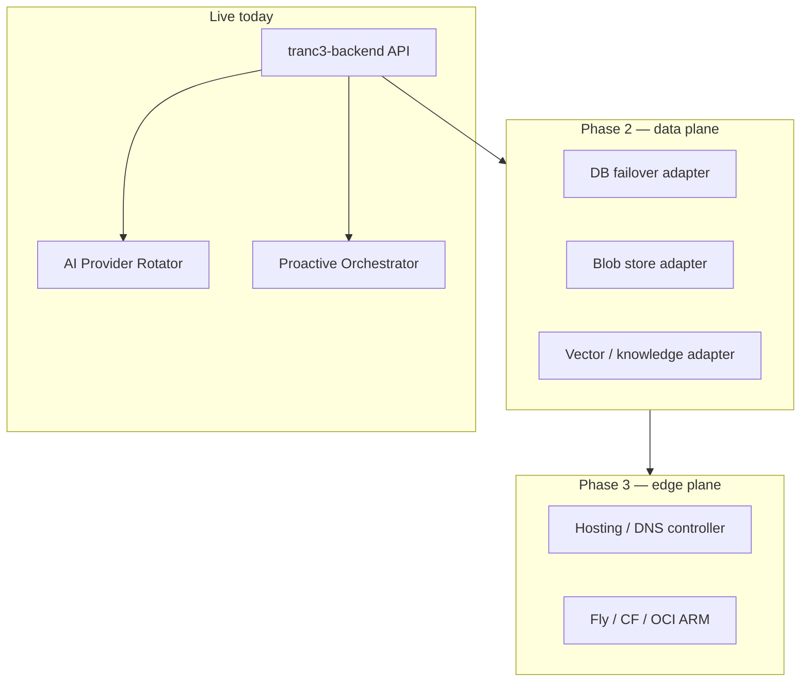

# Adaptive rotation — current state and roadmap

This document answers: *Is multi-cloud adaptive rotation still set up?* and *What would full-stack proactive rotation look like?*

**Short answer:** On your live **CLOUD_ONLY** Fly deploy, **AI inference rotation is active** inside `tranc3-backend`. **Hosting/DB/file-store rotation across OCI, Azure, and GCP is not automated yet** — those clouds are documented and partially scaffolded (IaC), but not wired into the same rotator that runs today.

---

## What is live after your Fly deploy

| Layer | Current home | Adaptive rotation today |
|-------|----------------|-------------------------|
| **Backend API** | Fly `tranc3-backend` (you deployed) | Yes — see below |
| **Bots** | Fly app `trancendos-bots` (must be created once) | Same API patterns when deployed |
| **AI inference** | AI Gateway + `AdaptiveProviderRotator` | **Yes** — `zero_cost_cloud` chain, auto-rotate ~180s |
| **Front end (Arcadia)** | Planned / partial in `web/` | No cross-host failover |
| **Hosting / edge** | Fly + legacy CF Workers (decommissioning) | No automatic host switch |
| **Database** | Supabase/Postgres via `DATABASE_URL` secret | No failover rotator |
| **Knowledge / RAG** | FAISS in-process + optional Pinecone | No provider rotation |
| **File store** | Local volume + IPFS path in Citadel design | No multi-cloud blob rotation |
| **Secrets** | Fly secrets / future Vault on Citadel | Manual |
| **CI/CD** | Forgejo (The Workshop) | Not in rotator |

Verify on production:

```text
GET https://tranc3-backend.fly.dev/adaptive/mode
GET https://tranc3-backend.fly.dev/adaptive/status
```

---

## AI rotation (implemented on `main`)

**Code:** `src/adaptive/provider_rotator.py`, `src/adaptive/cloud_rotation_loop.py`, `src/routers/adaptive.py`

**CLOUD_ONLY chain** (`config/platform/infrastructure_mode.yaml`):

`Groq → Gemini → Cerebras → SambaNova → OpenRouter → HuggingFace → Offline`

- Rotates on failure, rate limits, and cooldown (`ADAPTIVE_COOLDOWN_SECONDS`, default 300).
- Background tick when `ADAPTIVE_CLOUD_AUTO_ROTATE=true` (default in CLOUD_ONLY).
- Started from `api.py` lifespan via `start_cloud_auto_rotation()`.

**Not the same as:** rotating VMs between Oracle, Azure, and Google Cloud. Older branches may have had **IaC or deploy scripts** for those; on current `main` they are **optional overflow** in `docs/ZERO_COST_VENDOR_MATRIX.md` and `infrastructure/oracle-cloud/`, not connected to the live rotator.

**API keys required for cloud AI rotation** (set as Fly secrets or env):

| Provider | Env var |
|----------|---------|
| Groq | `GROQ_API_KEY` |
| Gemini | `GOOGLE_GEMINI_API_KEY` |
| Cerebras | `CEREBRAS_API_KEY` |
| SambaNova | `SAMBANOVA_API_KEY` |
| OpenRouter | `OPENROUTER_API_KEY` |
| HuggingFace | `HF_API_KEY` |

Without keys, discovery skips those providers and falls through to `offline` stub.

---

## Proactive automation (implemented)

**Code:** `src/adaptive/proactive_orchestrator.py`

Every `PROACTIVE_INTERVAL_SECONDS` (default 600):

1. Snapshot rotator status  
2. `scripts/health_check.py`  
3. `scripts/zero_cost_audit.py`  
4. `scripts/swarm_runner.py` with `config/swarm/manifests/adaptive-zero-cost.yaml`  

Logs: `logs/proactive-orchestrator.jsonl`

This is **proactive health/audit**, not automatic DNS cutover between clouds.

---

## Platform modes

| Mode | AI chain | Citadel Docker | Auto-rotate |
|------|----------|----------------|-------------|
| `CLOUD_ONLY` (default) | `zero_cost_cloud` | Skipped | Yes |
| `HYBRID` | `zero_cost_full` | Optional | Yes |
| `LOCAL_ONLY` | `zero_cost_full` | Required | Yes (includes Ollama when local) |

Switch at runtime: `POST /adaptive/mode` with `{"mode":"HYBRID"}` (persist in `.env` for restarts).

---

## OCI / Azure / GCP — what exists in the repo

| Asset | Purpose | Wired to adaptive rotator? |
|-------|---------|----------------------------|
| `docs/ZERO_COST_VENDOR_MATRIX.md` | Policy + limits for AWS/GCP/Azure/OCI/CF | Reference only |
| `config/zero_cost/providers.yaml` | Machine-readable registry | Audit scripts |
| `infrastructure/oracle-cloud/` | Optional OCI Always Free VM IaC | No |
| `infrastructure/opentofu/` | Generic IaC stub | No |
| `src/database/azure_sql.py` | Optional Azure SQL helper | No failover |
| Legacy CF Workers | Edge APIs (migrating off) | Separate from rotator |

**Conclusion:** Multi-hyperscaler **hosting** rotation from old branches was **not merged wholesale** into the current adaptive stack (see `docs/BRANCH_CONSOLIDATION.md`). What you have now is **zero-cost AI provider rotation** plus **proactive audits**, which matches CLOUD_ONLY on Fly until Citadel is ready.

---

## Roadmap — full-stack adaptive rotation (proposed)

Goal: one **Platform Layer Controller** that treats each tier as a pluggable backend with health, cost, and mode-aware policy.



### Phase 1 (done) — AI + proactive audit

- [x] `AdaptiveProviderRotator` + chains  
- [x] Cloud auto-rotation loop  
- [x] `/adaptive/*` API  
- [x] Proactive orchestrator + zero-cost audit  

### Phase 2 — Data plane rotation

| Layer | Candidates | Mechanism |
|-------|------------|-----------|
| **DB** | Supabase → SQLite read replica → Citadel Postgres | Connection pool with health probe; read-only fallback |
| **Knowledge** | FAISS local → Qdrant self-hosted → HF embeddings rotate | Same pattern as AI rotator for embed providers |
| **File store** | Fly volume → IPFS → R2/CF (legacy) | Content-addressed primary; optional mirror |

Deliverables: `src/platform/layer_rotator.py`, env `PLATFORM_DB_URLS`, `PLATFORM_BLOB_BACKENDS`.

### Phase 3 — Hosting / edge rotation

| Layer | Candidates | Mechanism |
|-------|------------|-----------|
| **API host** | Fly `tranc3-backend` ↔ OCI Always Free ↔ CF Worker | Health-checked upstream list in Traefik or external DNS failover |
| **Front end** | Vercel/CF Pages ↔ static on Citadel | CDN origin rotation |
| **Workers** | Self-hosted Python workers (ports 8004–8038) ↔ CF legacy | Already mapped in `CF_WORKER_MIGRATION_ROADMAP.md` |

Deliverables: extend `scripts/deploy_cloud.py` with optional `--target=oci|fly`, Terraform/OpenTofu apply hooks.

### Phase 4 — Unified control plane

- Dashboard tile in Infinity Admin OS: layer health + active provider per tier  
- Alerts via The Observatory when a layer fails over  
- Policy file: `config/platform/layer_rotation.yaml` (mirrors `infrastructure_mode.yaml`)

---

## What you should do next (practical)

1. **Bots on Fly** — create app once, then deploy:

```cmd
"%USERPROFILE%\.fly\bin\flyctl.exe" apps create trancendos-bots
cd C:\Users\agpor\Documents\Tranc3\tranc3-bots
"%USERPROFILE%\.fly\bin\flyctl.exe" deploy --remote-only --app trancendos-bots
```

2. **Set Fly secrets** on `tranc3-backend` (if not already): `DATABASE_URL`, `REDIS_URL`, `SECRET_KEY`, `JWT_SECRET`, plus AI keys above.

3. **Confirm adaptive endpoints** after deploy:

```cmd
curl https://tranc3-backend.fly.dev/adaptive/status
```

4. **Rotate exposed Fly token** — if a token was pasted in chat or logs, revoke it at fly.io and set a new one with `set "FLY_API_TOKEN=..."`.

5. **When Citadel is ready:** `PLATFORM_INFRA_MODE=LOCAL_ONLY` and `scripts/citadel_deploy_all.py --local` — switches chain to `zero_cost_full` (includes Ollama).

---

## Related docs

- [PLATFORM_INFRASTRUCTURE_MODE.md](./PLATFORM_INFRASTRUCTURE_MODE.md)  
- [ZERO_COST_VENDOR_MATRIX.md](./ZERO_COST_VENDOR_MATRIX.md)  
- [WINDOWS_DEPLOY.md](./WINDOWS_DEPLOY.md)  
- [BRANCH_CONSOLIDATION.md](./BRANCH_CONSOLIDATION.md)  
- [CF_WORKER_MIGRATION_ROADMAP.md](../CF_WORKER_MIGRATION_ROADMAP.md)  
