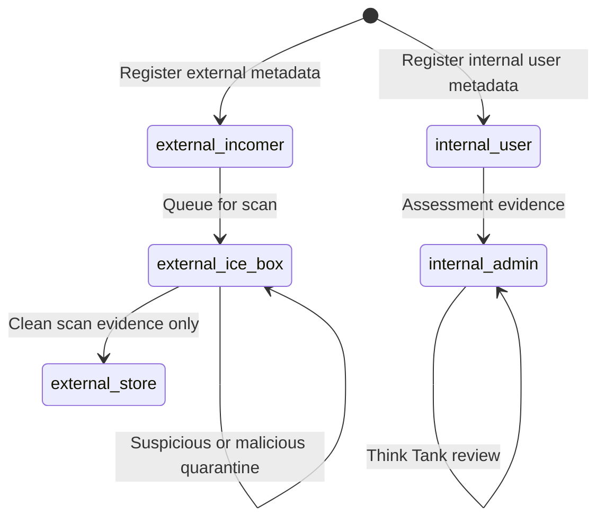

# Asset Lifecycle and Artifactory Custody

This document records the requested three-base Artifactory model and the implementation status. It is intentionally precise: a custody record is metadata, not proof that artifact bytes were moved, scanned, or executed.

## Ownership and Scope

| Area | Accountable location | Verified responsibility |
|---|---|---|
| User files and supplied context | DocUtari | Internal upload, metadata, extraction, and durable file storage |
| Built artifacts and dependencies | The Artifactory | Zot OCI/Gitea/local discovery and custody metadata |
| Quarantine register and static text scan | The Ice Box | SQLite quarantine register and text-only threat analysis |
| Detection and security assessment | Cryptex | Security worker service; integration with Artifactory intake is not wired |
| Integrity isolation | The Warp Tunnel | Local quarantine directory; it does not hand off to Ice Box today |
| Cryptographic identity and tokens | The Lighthouse | Design intent only; no worker is implemented in this repository |
| Evidence collection | The Observatory | Collects instrumented events, not every location by proof |

Testing is managed by **The Chaos Party**: The Mad Hatter owns adversarial, chaos, and mutation testing, while Alice Dream owns deterministic assurance, acceptance, regression, and smoke testing. The Workshop executes source-control and CI; it is not the testing authority. GitHub-hosted CI only reports results to Chaos Party when a reachable `CHAOS_PARTY_URL` is configured, which is currently not evidenced by this repository.

## Three Bases

| Base | Meaning | Current control |
|---|---|---|
| Base 1: Internal - User | User-owned, internally held artifact metadata | `internal-user` custody record; requires assessment evidence before promotion |
| Base 2: Internal - Admin | Admin/Think Tank assessment space | `internal-admin` record enters `think-tank-review`; an accountable decision is required |
| Base 3: External - Incomer | Untrusted dependency or component intake | `external:incomer` received record |
| Base 3: External - Ice Box | Quarantine and scan evidence hold | `external:ice-box` awaiting scan, cleared, or quarantined state |
| Base 3: External - Store | Admitted external record | `external:store` only after a `clean` recorded scan result |

The real Artifactory worker exposes internal-authenticated custody endpoints under `/artifactory/custody`. It requires a SHA-256 digest and rejects unrecognised fields such as raw content. It never fetches, uploads, scans, executes, or relocates bytes. That property is deliberate: the state machine cannot become a false assurance boundary merely because someone posted a status field.

## Safe State Transitions

Rejected, suspicious, and malicious records do not advance. The service returns a conflict rather than retrying an invalid transition. This is intentional deterministic-failure behavior.

## What Is Not Implemented

- **No byte-level handoff exists** between Artifactory, DocUtari, Warp Tunnel, Ice Box, Cryptex, or Zot. The custody ledger records evidence only.
- **Ice Box is not a VM or container detonation service.** The worker is a quarantine register with a text-content threat analyser. A Cuckoo container is declared in Compose, but this repository does not connect Artifactory or Ice Box to it or prove it is healthy.
- **Lighthouse is not the quarantine authority.** Its described cryptographic tagging role has no worker implementation. Warp Tunnel is the named isolation route, but its Ice Box handoff is missing.
- **No autonomous AI promotion occurs.** Base 1 to Base 2 requires an assessment reference and rationale; Base 2 requires a recorded Think Tank decision. Introducing an AI assessor requires a separately approved identity, provenance, threshold, rollback, and human escalation design.
- **Zot/Gitea package storage is not partitioned by these bases.** The metadata ledger is a control-plane contract only. Storage-plane prefixes, ACLs, retention, and deletion propagation remain to be implemented and tested.

## Implementation Sequence

1. Run a dedicated, isolated Ice Box executor with no host Docker socket, outbound network deny-by-default, resource limits, disposable storage, and signed scan result callbacks.
2. Bind artifact digest to the actual Zot/Gitea object and require the callback digest to match the custody record before `external:store` admission.
3. Add Cryptex/YARA/ClamAV results as signed evidence, keeping suspicious and malicious content quarantined rather than automatically deleting forensic evidence.
4. Add per-base storage ACLs and retention in the real registry, then test cross-base access denial and deletion/hold propagation.
5. Send signed custody lifecycle events to The Observatory and make their Library output a Wiki draft, never a self-approved KB article.

These are deployment and security engineering tasks, not GitHub Actions tasks. They should be run on internal or self-hosted infrastructure to avoid hosted-runner cost and to keep untrusted files away from CI workers.
