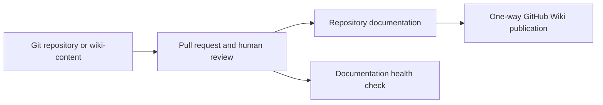
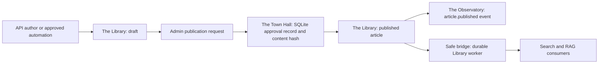

# Document Lifecycle and Accountability

This document separates current, verified document flows from intended platform roles. It does not claim that every repository Markdown file is already stored in a platform Location.

## Who Owns What

| Responsibility | Accountable Location | Seed lead | How to find the current assignee |
|---|---|---|---|
| Source-control custody | The Workshop | Larry Lowhammer | `GET /roles/The Workshop` |
| Knowledge stewardship | The Library | Zimik | `GET /roles/The Library` |
| Publication review record | The Town Hall | Tristuran | `GET /roles/The Town Hall` |
| Post-publication audit event | The Observatory | Norman Hawkins | `GET /roles/The Observatory` |
| Archive and retrieval consumer | The Basement | Gary Glowman (Glow-Worm) | `GET /roles/The Basement` |

The names in the platform entity registry are seed leads, not a substitute for a current assignment. The SQLite-backed role registry is the live authority through the `/roles/{location}` endpoint. There is currently no mapping between those platform roles and GitHub accounts, and the repository has no `CODEOWNERS` file. GitHub pull-request approval must therefore be configured in repository branch protection until an identity mapping is deliberately introduced.

## Current Flows

### Repository and Wiki Documents

Repository Markdown originates in Git/GitHub and `wiki-content/`; it is not automatically ingested by The Library, DocUtari, or The Basement. The Workshop is the platform's accountability Location for source-control custody, but GitHub remains the actual repository transport and review surface. `scripts/documentation_health.py` validates paths, navigation, lifecycle mappings, and source-to-canonical-document coupling. It does not approve content, publish a draft, or invent documentation.

### Runtime Library Articles

All new runtime articles are drafts. Automated Observatory, workflow, AI-inference, and research summaries remain drafts; they cannot silently become platform knowledge. An administrator publishes through `POST /library/articles/{article_id}/publish`. Publication first writes a durable approval record to The Town Hall's ITSM database with the article ID, reviewer, UTC timestamp, and SHA-256 hash of title plus body. If that write fails, publication fails and the article remains a draft.

Only a published `PUBLIC` or `INTERNAL` article that passes the existing PII, legal-hold, and jurisdiction gates may be sent by the best-effort bridge to `workers/library-service`. The bridge is not an authoritative reader and never receives confidential or restricted content. Publication emits an Observatory event after the Town Hall record exists. An administrator can retrieve a review trail at `GET /townhall/itsm/documents/{article_id}/reviews`.

Editing a published article's content, tags, classification, jurisdiction, source, or legal-hold state returns it to draft and clears its previous review metadata. When no legal hold applies, the platform also makes a best-effort request to remove the previous durable worker copy before re-review; a legal hold deliberately preserves it. The changed article must receive a new Town Hall approval before republishing. This prevents a reviewed article from being materially altered after approval.

## What Does Not Happen Today

- **DocUtari is not a destination for repository Markdown.** No verified ingestion route currently writes repository or Wiki files to that Location.
- **The Basement does not receive repository Markdown automatically.** It is a downstream archive/retrieval consumer for eligible Library knowledge, not a source-control mirror.
- **The Library does not import all repository documents.** Manual promotion remains required while ownership, classification, GitHub identity, deletion propagation, and rollback semantics are not yet fully integrated.
- **The Observatory does not receive a per-commit document event for static docs.** It observes runtime article lifecycle events; GitHub remains the commit audit source for repository documentation.

These restrictions are intentional safety boundaries. Automatic ingestion will be considered only after the repository has reviewed `CODEOWNERS` and identity mappings, provenance and classification rules, content deletion/rollback synchronization, and a tested approval boundary.

## Operational Rules

1. Update the canonical document named in `config/docs/living_documents.yaml` whenever its mapped source changes.
2. Treat the lifecycle Locations in the registry as accountability assignments; check `/roles/{location}` for the live person or agent assigned to a role.
3. Create or ingest runtime knowledge as a draft. Do not use a direct object construction to bypass `Library.publish()` outside controlled bootstrap fixtures.
4. Publish only after an accountable administrator has reviewed the exact content. The Town Hall record is the audit evidence, not a substitute for review.
5. Do not bulk-ingest repository documentation or auto-remediate prose based on heuristics. Deterministic navigation and lifecycle contract failures should fail CI; editorial or semantic ambiguity requires a reviewer.
