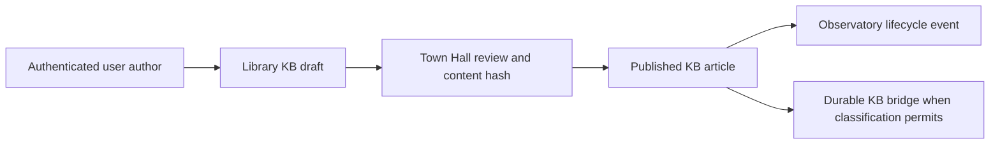
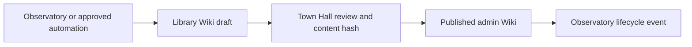
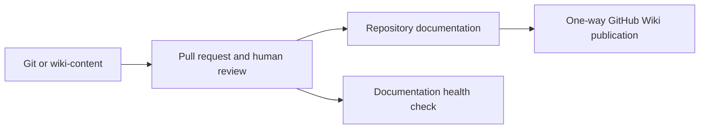
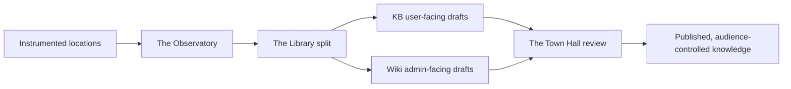

# Document Lifecycle and Accountability

This is the verified document and knowledge model for Tranc3. It distinguishes live controls from intended architecture so a location name is never mistaken for a deployed integration.

## Accountable Locations

| Responsibility | Accountable Location | Current runtime evidence |
|---|---|---|
| Source-control custody | The Workshop | Git repository, pull requests, and CI |
| User-facing knowledge base | The Library, KB channel | `POST /library/articles` creates a `kb` draft |
| Admin-facing knowledge base | The Library, Wiki channel | Published `wiki` articles are admin-only |
| Review decision and audit record | The Town Hall | SQLite ITSM review record with content hash |
| Runtime event collection | The Observatory | Event-derived draft pipeline |
| Archive and pattern retrieval | The Basement | Observatory pattern promotion and archive consumer |
| User file/context intake | DocUtari | Internal authenticated upload, parsing, and storage |
| Built/dependency artifact custody | The Artifactory | Zot/Gitea bridge plus metadata custody ledger |

The entity registry contains seed leads. The live assignment is the SQLite role registry through `GET /roles/{location}`. There is no verified mapping from platform roles to GitHub identities, and this repository has no `CODEOWNERS` file.

## Knowledge Routes

### User-facing KB

Non-admin callers can create only `kb` articles. Every article begins as a draft. An administrator publishes it through `POST /library/articles/{article_id}/publish`; this first records the reviewer, UTC timestamp, location, and SHA-256 content hash in the Town Hall ITSM database. If that write fails, publication fails. A published KB article remains subject to classification, PII, legal-hold, and jurisdiction gates before it can be copied to the lower-trust durable Library worker.

### Admin-facing Wiki

Automated Observatory, workflow, research, Basement, and model-governance outputs explicitly use the `wiki` channel and remain drafts until reviewed. A published Wiki article is readable only by an administrator and is deliberately not copied to `workers/library-service`, because that worker does not implement the Library's audience and classification authorization model.

Editing published content, tags, classification, jurisdiction, source, legal-hold state, or channel demotes it to draft and clears its review metadata. A new Town Hall approval is required before republishing.

## Repository Docs and GitHub Wiki

Repository Markdown and `wiki-content/` originate in Git/GitHub. They are not automatically ingested into The Library, DocUtari, or The Basement. `scripts/documentation_health.py` checks navigation, lifecycle mappings, and code-to-canonical-document coupling; it does not approve prose or publish runtime knowledge.

The versioned GitHub Wiki source is intended for administrators. The repository cannot prove the live GitHub Wiki's access settings, so making it genuinely admin-only still requires repository or organisation access configuration outside this codebase.

## Observatory, Library, Town Hall, and Basement

The requested direction is correct for event-derived knowledge:

Today, the verified implementation covers eligible Observatory events into Wiki drafts and emits Observatory events after Library lifecycle changes. It does **not** prove that every platform location is instrumented, and static repository documentation remains outside this runtime stream. The established test-evidence route is separate: Chaos Party test evidence can pass through The Observatory and The Basement before a Library Wiki draft is proposed.

The Basement is the archive and retrieval consumer. It is not an automatic mirror of Git or DocUtari, and it must not be used as a substitute for a legal-hold system of record.

## DocUtari Boundary

DocUtari is the internal-authenticated A-to-Z file/context intake point. It accepts `UploadFile` content without an extension allow-list, stores metadata and payload, and can send content to Tika and Paperless. The upload route now strips client path components and enforces `DOCUTARI_MAX_UPLOAD_BYTES` (50 MiB default) before persistence; it does not execute uploads or represent a malware sandbox.

Files accepted by DocUtari are not automatically Artifactory artifacts, Library articles, or Basement records. Promotion between those locations requires an explicit, reviewable workflow and a provenance decision.

## Operational Rules

1. Use `kb` only for user-facing knowledge; use `wiki` for admin-facing and automated operational knowledge.
2. Treat the Town Hall hash record as audit evidence, not as an automatic approval authority.
3. Keep GitHub Wiki access configuration aligned with its admin-facing purpose; this cannot be enforced by a repository workflow alone.
4. Do not bulk-ingest static docs or auto-publish AI output. Deterministic contract failures fail CI; semantic/editorial ambiguity requires review.
5. Use the Artifactory custody contract in `docs/ASSET_LIFECYCLE.md` for built artifacts and external dependencies.
