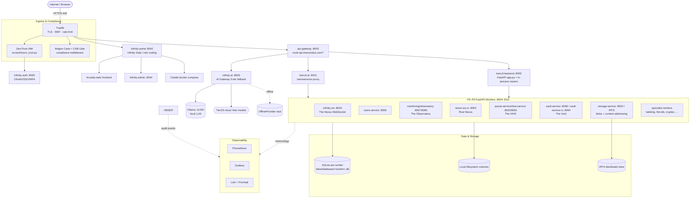
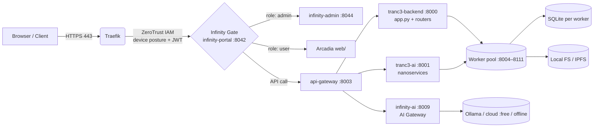
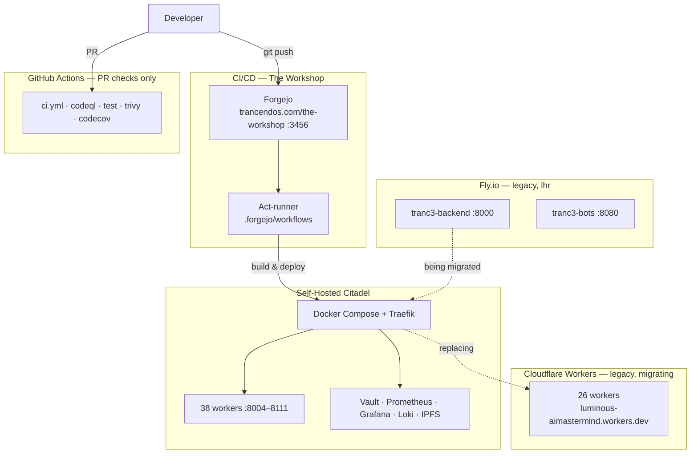

# Trancendos — Architectural Topology Map

**Version:** 1.0.0 | **Classification:** UNCLASSIFIED — INTERNAL
**Date:** 2026-08-21 | **Owner:** Platform Engineering

> This is the single cross-cutting topology map for the platform. It complements,
> and does not replace, the per-concern architecture documents in this directory
> (`AS-BUILT-ARCHITECTURE.md`, `BLUEPRINT.md`, `THREE-LANE-TRANSPORT.md`,
> `SHARED-FUNCTIONAL-SERVICES-CORE.md`, `CONTROL-TO-COMPONENT-MAP.md`).
>
> **Source of truth for ports:** every port in the table below was extracted
> programmatically from `docker-compose.production.yml` (the 88 services that
> declare a `build:` target) using the same precedence rule as
> `scripts/port_registry_validate.py`:
> `PORT` env → Traefik `loadbalancer.server.port` label → published `ports:` host
> mapping. `scripts/port_registry_validate.py` is the CI guard that keeps
> `CLAUDE.md`'s hand-maintained port table in sync with compose. The machine-readable
> equivalent of this map is `docs/architecture/topology-graph.json` (regenerated by
> `scripts/build_topology_map.py`; freshness checked by
> `scripts/check_topology_map_freshness.py`).

---

## 1. Service Topology Diagram

The platform is a self-hosted Docker Compose stack. All application traffic enters
through a single ingress (Traefik), is authenticated by Infinity, then fans out to
FastAPI workers. Workers are **isolated**: each owns its own SQLite database and
local filesystem; there is no shared database and no mandatory paid external service.



**Reading the diagram.** Solid arrows are request/response or data paths that exist
today. Dotted arrows are telemetry/observability flows. The Rust services
(`nexus-ws-rs`, `vault-service-rs`, `rate-limit-service-rs`, `bullmq-queue-service`)
co-exist on the platform alongside their Python counterparts (see §4 notes).

---

## 2. Service-to-Port Mapping Table

Ports below are the **compose-routed** values (container-exposed). Traefik publishes
them internally on the Docker network; only Traefik (443/80) is internet-facing.

| Port | Service (compose name) | Maps to / Role | Priority |
|-----:|------------------------|----------------|----------|
| 8000 | `tranc3-backend` | FastAPI main app (`api.py`) + in-process routers | core |
| 8001 | `tranc3-ai` | nanoservices proxy (internal) | core |
| 8002 | `infinity-void` | The Void — self-hosted AES-GCM vault | P3 |
| 8003 | `api-gateway` | API gateway — `api.trancendos.com/*` | P2 |
| 8004 | `infinity-ws` | The Nexus — WebSocket hub (Python) | P0 |
| 8004 | `nexus-ws-rs` | The Nexus — WebSocket hub (Rust) | P0 |
| 8005 | `infinity-auth` | Infinity — OAuth2/SSO/MFA engine | P0 |
| 8006 | `users-service` | users management | P1 |
| 8007 | `monitoring` | The Observatory — metrics/monitoring dashboard | P1 |
| 8008 | `notifications` | notification service | P1 |
| 8009 | `infinity-ai` | AI Gateway — 5-tier inference fallback | P1 |
| 8010 | `the-grid` | The Digital Grid — workflow API | P2 |
| 8011 | `products-service` | products catalogue | P2 |
| 8012 | `orders-service` | orders | P2 |
| 8013 | `payments-service` | payments (Stripe PSP only) | P2 |
| 8014 | `files-service` | files (DocUtari) | P2 |
| 8015 | `identity-service` | identity (Infinity OS) | P2 |
| 8016 | `analytics-service` | analytics / metrics store | P3 |
| 8017 | `search-service` | full-text + semantic search | P3 |
| 8018 | `email-service` | email hub (Arcadia) | P3 |
| 8019 | `sms-service` | SMS gateway | P3 |
| 8020 | `storage-service` | IPFS + local blob storage | P3 |
| 8021 | `cron-service` | ChronosSphere task scheduler | P3 |
| 8022 | `queue-service` | The HIVE task queue (Python) | P3 |
| 8023 | `cache-service` | distributed cache layer | P3 |
| 8024 | `config-service` | central configuration | P3 |
| 8025 | `audit-service` | The Observatory audit trail | P3 |
| 8026 | `rate-limit-service` | token-bucket rate limiter (Python) | P3 |
| 8027 | `geo-service` | geographic routing | P3 |
| 8028 | `cdn-service` | static asset delivery | P3 |
| 8029 | `health-aggregator` | platform-wide health roll-up | P3 |
| 8030 | `gbrain-bridge` | GBrain AI bridge | P3 |
| 8031 | `topology-service` | service topology graph | P3 |
| 8032 | `ledger-service` | Royal Bank ledger | P3 |
| 8033 | `model-router-service` | AI model routing | P3 |
| 8034 | `workflow-engine-service` | The Digital Grid engine | P3 |
| 8035 | `skills-benchmark-service` | Turing's Hub benchmarks | P3 |
| 8036 | `langchain-integration-service` | LangChain orchestration | P3 |
| 8037 | `deepagents-orchestrator-service` | deep agent orchestration | P3 |
| 8038 | `vault-service` | The Void self-hosted vault (Python) | P3 |
| 8039 | `mlflow-service` | MLflow experiment tracking | P3 |
| 8041 | `sentinel-station-service` | Sentinel Station — platform guardian | P2 |
| 8042 | `infinity-portal` | Infinity Portal — front entrance + Gate | P1 |
| 8043 | `infinity-one` | Infinity-One — single identity layer | P1 |
| 8044 | `infinity-admin` | Infinity Admin — Admin OS | P1 |
| 8045 | `infinity-shards` | Infinity Shards — pluggable power-ups | P1 |
| 8046 | `ice-box-service` | The Ice Box — sandbox threat isolation | P3 |
| 8047 | `artifactory-service` | The Artifactory — Zot OCI registry bridge | P2 |
| 8048 | `fabulousa-service` | Fabulousa — UX/UI/design | P3 |
| 8049 | `litellm-service` | LiteLLM zero-cost AI proxy | P3 |
| 8050 | `blender-worker` | Blender render worker | P3 |
| 8051 | `hive-service` | The HIVE — task queue / agent coordination | P3 |
| 8052 | `ffmpeg-worker` | FFmpeg media worker | P2 |
| 8053 | `cryptex` | Cryptex — cyber defense / threat intel | P3 |
| 8055 | `the-lab` | The Lab — code creation platform | P3 |
| 8056 | `the-academy` | The Academy — LMS / skill training | P3 |
| 8057 | `the-dutchy` | The Dutchy — intelligence & market analysis | P3 |
| 8058 | `turings-hub-service` | Turing's Hub — AI personality creator | P3 |
| 8059 | `tranceflow` | TranceFlow — 3D/game creation | P3 |
| 8060 | `vrar3d` | VRAR3D — Three.js / A-Frame immersion | P3 |
| 8061 | `tateking` | TateKing — video creation/editing | P3 |
| 8062 | `sashas-photo-studio` | Sashas Photo Studio — image generation | P3 |
| 8064 | `imaginarium` | Imaginarium — omni-creative orchestrator | P3 |
| 8065 | `observatory` | The Observatory — audit trail worker | P3 |
| 8066 | `lab-service` | The Lab extended service layer | P3 |
| 8067 | `library-service` | The Library — knowledge base / wiki | P3 |
| 8068 | `basement` | The Basement — archived info store | P3 |
| 8069 | `the-studio` | The Studio — central creativity hub | P3 |
| 8070 | `infinity-bridge` | Infinity Bridge — human traffic transfer hub | P1 |
| 8071 | `cranbania` | The Town Hall — Kanban+ITSM+Agile (Next.js) | P1 |
| 8072 | `warp-tunnel` | The Warp Tunnel — crypto scanner / quarantine | P3 |
| 8073 | `warp-radio` | Warp Radio — music/audio streaming | P3 |
| 8074 | `taimra` | tAimra — opt-in digital twin | P3 |
| 8075 | `imind` | I-Mind — emotion sensitivity engine | P3 |
| 8076 | `resonate` | Resonate — empathy engine | P3 |
| 8077 | `tranquility` | Tranquility — wellbeing hub | P3 |
| 8078 | `backup-service` | automated data backup | P3 |
| 8079 | `chaos-party` | The Chaos Party — central testing platform | P3 |
| 8092 | `bullmq-queue-service` | BullMQ queue (Node/Redis) | P3 |
| 8093 | `remotion-render-service` | Remotion video render | P3 |
| 8094 | `vault-service-rs` | The Void vault (Rust) | P3 |
| 8096 | `llamaindex-service` | LlamaIndex — RAG | P3 |
| 8097 | `haystack-service` | Haystack — production RAG | P3 |
| 8098 | `dspy-service` | DSPy — prompt compiler | P3 |
| 8099 | `rate-limit-service-rs` | token-bucket rate limiter (Rust) | P3 |
| 8109 | `swarm-coordinator-service` | Swarm Coordinator — agent swarms | P3 |
| 8110 | `devocity` | DevOcity — development ops hub | P3 |
| 8111 | `triposr-worker` | TripoSR 3D model generation | P3 |

### Infra / backbone services (no `build:` target — run as images)

| Port | Service | Role |
|-----:|---------|------|
| 80 / 443 | `traefik` | Reverse proxy, TLS termination, WAF, rate limiting |
| — | `vault` (HashiCorp) | Secrets management, Shamir unseal |
| — | `prometheus` | Metrics collection |
| — | `grafana` | Dashboards |
| — | `loki` + `promtail` | Log aggregation |
| — | `ipfs` | Distributed content-addressed storage |
| — | `redis` | Cache / BullMQ queue backend |
| 11434 | `ollama` (host) | Local LLM for AI Gateway Tier 1 |

### Notable co-located / parallel implementations

These pairs share a concern and co-exist on the platform today (documented as
duplication candidates in `docs/architecture/SHARED-FUNCTIONAL-SERVICES-CORE.md`):

- **Nexus transport:** `infinity-ws` (Python, :8004) and `nexus-ws-rs` (Rust, :8004) — Traefik routes by label, so both answer :8004.
- **Vault:** `vault-service` (Python, :8038) and `vault-service-rs` (Rust, :8094).
- **Rate limiter:** `rate-limit-service` (Python, :8026) and `rate-limit-service-rs` (Rust, :8099).
- **Queue:** `queue-service` (Python/The HIVE, :8022) and `bullmq-queue-service` (Node/Redis, :8092).

---

## 3. Data Flow

### 3.1 Ingress → Auth → Core → Workers → Storage



### 3.2 Authentication flow

```
User → POST /auth/login → infinity-portal (:8042)
     → infinity-auth (:8005)  [OAuth2 / MFA verification]
     → JWT issued (HS256, JWT_SECRET)
     → Infinity Gate routes by role
     → ZeroTrust middleware validates JWT + device posture on every subsequent request
```

### 3.3 Compliant mutation flow (CAB gate)

```
Admin → PUT /admin/config → Traefik
     → CABMiddleware: requires X-Change-ID header
     → cab_gate.check_change(id) → approved?
          ├─ yes → request proceeds
          └─ no  → 403 + CAB_REQUIRED
     → The Observatory logs the CAB decision + request metadata
```

### 3.4 AI inference flow (5-tier fallback)

```
Client → infinity-ai (:8009) → AIGatewayRouter (src/ai_gateway/)
   ↓ Tier 1: Ollama (:11434)            — local, zero cost
   ↓ FAIL → Tier 2: HuggingFace free tier
   ↓ FAIL → Tier 3: OpenRouter :free
   ↓ FAIL → Tier 4: TRANC3_BACKEND_URL (tranc3-backend :8000)
   ↓ FAIL → Tier 5: OfflineProvider (deterministic stub)
```

LRU cache (1000 entries), per-tenant token budgets, per-provider circuit breaker.

### 3.5 Three-Lane Transport (design of record)

Traffic is split into three separately-secured lanes that converge at a per-Location
**Terminal Hub** (see `THREE-LANE-TRANSPORT.md`):

| Lane | Owner | Carries |
|------|-------|---------|
| 1 — Entity | The Nexus (`infinity-ws` :8004) | AI / Agent / Bot traffic, inter-agent messages |
| 2 — Human | Infinity Bridge (`infinity-bridge` :8070) | user sessions, navigation, human actions |
| 3 — Payload | The HIVE (`queue-service` :8022 / `hive-service` :8051) | files, blobs, bulk data, queue payloads |

A shared `trace_id` (W3C TraceContext, `src/observability/tracing.py`) correlates all
three lanes. **Honest status:** lane transport exists partially; Terminal Hub
correlation is *not yet built* — see `THREE-LANE-TRANSPORT.md` §5.

---

## 4. Inter-Service Communication Protocols

| Protocol | Used by | Direction |
|----------|---------|-----------|
| **HTTP / JSON (REST)** | All FastAPI workers, Traefik → workers, Service Mesh (`src/mesh/`) calls via `httpx` | Synchronous request/response |
| **WebSocket** | `infinity-ws` / `nexus-ws-rs` (:8004) — pub/sub hub, channels, broadcast | Push / real-time, server↔client |
| **Server-Sent Events (SSE)** | The Spark (`src/mcp/`) MCP SSE bus (`/mcp/sse`) | Streaming server→client |
| **JSON-RPC 2.0** | The Spark MCP (`/mcp/rpc`) — tool registry | Synchronous RPC over HTTP |
| **Redis pub/sub + queue** | Event Bus (`src/event_bus/`), `queue-service` (:8022), `bullmq-queue-service` (:8092), `cache-service` (:8023) | Async events / job dispatch |
| **SQLite (WAL)** | Every worker's own `data/databases/<worker>.db` | Local persistence (no cross-service DB) |
| **IPFS** | `storage-service` (:8020) + `ipfs` backbone | Content-addressed blob storage |
| **JWT (HS256)** | `infinity-auth` (:8005) issues; ZeroTrust validates on every hop | Auth bearer |

**Not in the current stack:** there is no gRPC service mesh today — inter-service
calls use HTTP/JSON (via the mesh's `httpx` client with retries + circuit breakers)
or Redis events. Do not assume gRPC exists when adding a new worker.

---

## 5. Deployment Topology



| Environment | System | Role | Notes |
|-------------|--------|------|-------|
| Primary CI/CD | **Forgejo (The Workshop)** | build, test, deploy pipelines | `trancendos.com/the-workshop` (:3456); Act-runner in `deploy/forgejo/` |
| Serverless (legacy) | **Cloudflare Workers** | 26 legacy workers (auth, hive, grid, payments…) | `luminous-aimastermind.workers.dev`; migrating to self-hosted Python workers |
| PaaS (legacy) | **Fly.io** | `tranc3-backend` (:8000), `tranc3-bots` (:8080) | region `lhr`; evaluating for migration to Citadel |
| Self-hosted | **The Citadel** | Docker Compose + Traefik + Vault + observability | the default zero-cost deployment target |
| PR checks | **GitHub Actions** | `ci.yml`, `codeql.yml`, `test.yml`, `trivy.yml`, `python.yml`, `rust.yml`, `go.yml` | gates PRs; not a deployment path |
| Frontend | **Arcadia (`web/`)** | post-login forum/email hub | served behind Infinity Gate |
| Polyglot agent framework | **AeonMind** | Rust + Go + Python + WASM spec | only the Python bridge (`src/routers/aeonmind.py`) is live; Rust/Go/WASM runtime is scanned in CI but **not deployed** |

### Deployment modes per location

Each Location supports three modes (see `infrastructure-modes.md` and `CLAUDE.md`):
**Cloud Only** (current default), **Hybrid**, and **Local/Self-Hosted**. Standing policy:
avoid GitHub Actions and Cloudflare Workers wherever possible — the self-hosted,
zero-cost posture is the actual target, gated on funding rather than a committed
timeline.

---

## 6. How this map is kept accurate

- **Ports:** `scripts/port_registry_validate.py` fails CI if `CLAUDE.md`'s port table
  diverges from `docker-compose.production.yml`.
- **Graph:** `scripts/build_topology_map.py` regenerates `docs/architecture/topology-graph.json`
  + `topology-map.html` from live `api.py` mounts, compose services, and
  `src/entities/platform.py`; `scripts/check_topology_map_freshness.py` fails CI on drift.
- **Registry:** `src/entities/platform.py` (`PLATFORM_ENTITIES`) is the canonical 43-entity
  name registry; `config/estate/naming_conventions.md` is the naming contract.

Regenerate after any change to `api.py` mounts, `docker-compose.production.yml` services,
`src/entities/platform.py`, or the Matrix Suites registry.

---

## 7. See also

- `AS-BUILT-ARCHITECTURE.md` — as-built worker topology, auth, AI, compliance, data layers
- `BLUEPRINT.md` — vision, principles, layer diagram, security zones
- `THREE-LANE-TRANSPORT.md` — entity/human/payload lanes + Terminal Hub
- `SHARED-FUNCTIONAL-SERVICES-CORE.md` — the `Dimensional` shared core + duplication findings
- `CONTROL-TO-COMPONENT-MAP.md` — Magna Carta / DEFSTAN control → code component map
- `topology-graph.json` / `topology-map.html` — machine-readable + interactive viewer
