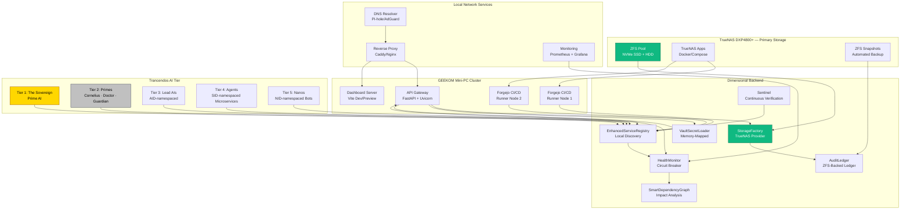
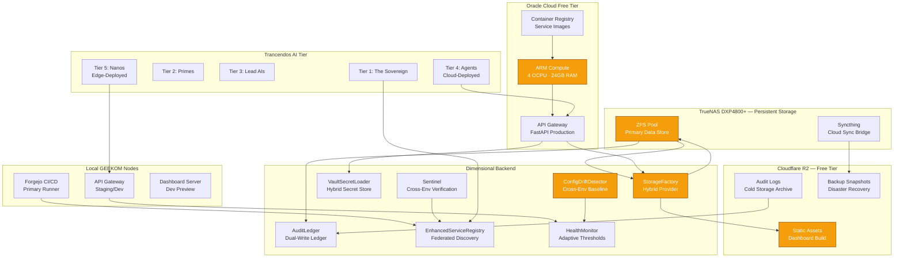
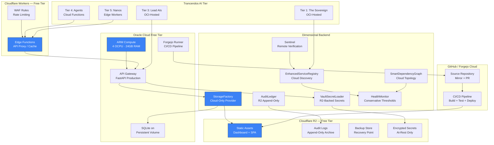
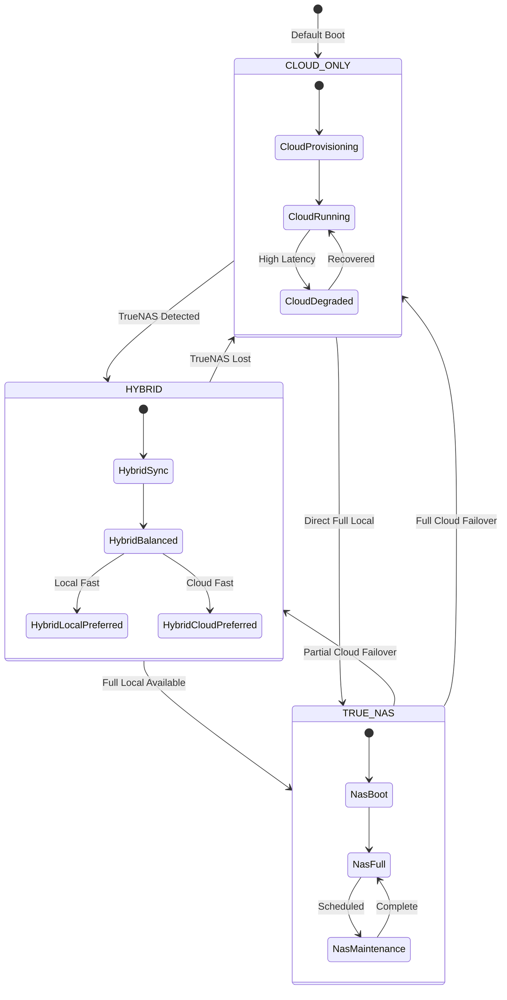
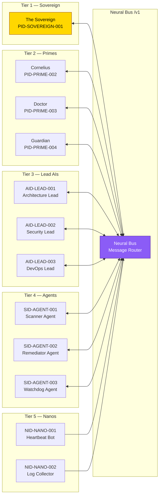

# Trancendos Infrastructure Architecture — Mermaid Diagrams

This document provides Mermaid diagrams for each SYSTEM_MODE deployment topology.

## TrueNAS Mode (TRUE_NAS)

Full local infrastructure — all services run on-premises with TrueNAS DXP4800+ as the primary storage backend.

## Hybrid Mode (HYBRID)

Mixed infrastructure — local TrueNAS for persistent data, free-tier cloud for compute and edge services.

## Cloud-Only Mode (CLOUD_ONLY)

Fully remote infrastructure — no local hardware. All services run on free-tier cloud providers.

## System Mode Transition Flow

## Neural Bus Protocol — AI-to-AI Communication

