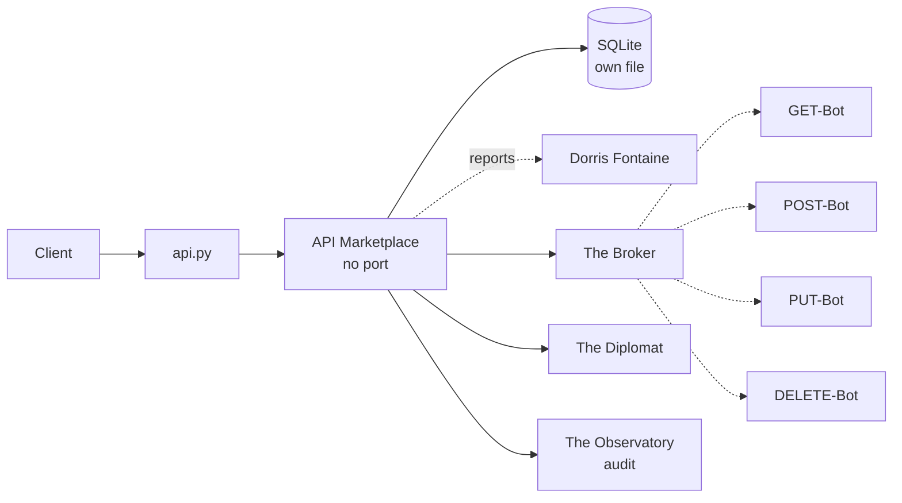

# Solution Pack — API Marketplace

> **PID-APM · AID-APM-01 · Commercial / Financial pillar**
>
> Generated by `scripts/build_solution_packs.py`. **DERIVED** sections are read
> from the registers named inline and are verifiable. **SCAFFOLD** sections are
> generated starting points shaped by those facts — drafts to accept or replace,
> not descriptions of what exists.

## 1. What this is — DERIVED

| Field | Value | Source |
|---|---|---|
| Location | API Marketplace | `src/entities/platform.py` |
| Product ID | `PID-APM` | `_assign_ids()` |
| Lead AI | Solarscene (`AID-APM-01`) | `src/entities/platform.py` |
| Base model tier | Tranc3 | `get_orchestration_tier()` |
| Job Description | Head of API Integrations | `docs/governance/LOCATION-FUNCTIONS.md` |
| Pillar | Commercial / Financial | `Pillar` enum |
| Reports to Prime(s) | Dorris Fontaine | `primes` |
| Status | ✅ In repo | `CLAUDE.md` service table |
| Code path | `src/apimarket/` ✅ on disk | filesystem |
| Port | _unassigned_ | compose / `worker_port` |
| OSS foundation | `gravitee-io/gravitee-api-management` (4K★, Apache 2.0) | CLAUDE.md |

**Role.** Central integration hub — REST, webhooks, OAuth

## 2. What it does — DERIVED

**Primary function.** Central Integration Hub (APIs, Webhooks, OAuth)

**Abilities**
- Connective Tissue: Brokers REST/GraphQL/Webhooks/OAuth.
- Schema Auto-Discovery: Generates plug-and-play modules.

**Operating modes**

- *Online:* Active API routing; live OAuth and webhook dispatching.
- *Offline:* Local API mocking; offline endpoint integration mapping.

The offline mode is a design constraint, not a footnote: it states what this
Location must still deliver when its upstreams are unreachable, and any
implementation that cannot honour it is incomplete regardless of test coverage.

## 3. Architectural requirements — DERIVED constraints, SCAFFOLD targets

**Hard constraints — these come from the estate, not from preference.**

- Runs in-process under `api.py` (path `src/apimarket/`), so it *may*
  import from `src/` — but that also means it shares the backend's failure domain.
- **SQLite over shared state** — each worker owns its own database file (principle 1).
- **In-memory token-bucket rate limiting** — no external KV (principle 2).
- **Zero-cost posture** — no paid dependency may be introduced without funding sign-off.

**Non-functional targets — SCAFFOLD, set these against real measurements.**

| Attribute | Starting target | Why this number needs replacing |
|---|---|---|
| Health endpoint | `GET /health` < 200 ms | compose healthcheck already polls it |
| p95 latency | < 500 ms | placeholder — no load profile exists yet |
| Availability | 99% single-node | one chassis; see `deploy/CITADEL_OPERATIONS.md` §9 |
| Data durability | volume-backed + off-box backup | snapshots are not backups |

## 4. Design schematic — DERIVED topology



## 5. Blueprint — SCAFFOLD

| Layer | Component | Note |
|---|---|---|
| Ingress | in-process router | mounted in api.py |
| API | FastAPI app | `/health`, `/status`, domain routes |
| Domain | The Broker + The Diplomat | the two Agents below |
| Automation | GET-Bot, POST-Bot, PUT-Bot, DELETE-Bot | the four Bots below |
| Persistence | SQLite | volume not yet declared |
| Observability | structured JSON + W3C trace | `src/observability/tracing.py` |

## 6. Storyboard and schema — SCAFFOLD

A first-run journey, derived from the abilities above. Replace with the real
journey once a user has actually walked it.

```
1. Request arrives  →  api.py routes
2. The Broker — Standardizes input/output formats for different APIs.
3. The Diplomat — Handles external handshakes, authentications, and secure keys.
4. Bots fire: GET-Bot, POST-Bot, PUT-Bot, DELETE-Bot
5. Result persisted to SQLite; event emitted to The Observatory
6. Response returned with trace_id for correlation
```

**Proposed schema** — shaped by the abilities; not yet implemented.

```sql
CREATE TABLE IF NOT EXISTS api_marketplace_records (
    id           INTEGER PRIMARY KEY AUTOINCREMENT,
    record_id    TEXT NOT NULL UNIQUE,
    actor        TEXT,
    payload      TEXT NOT NULL,        -- JSON
    state        TEXT NOT NULL DEFAULT 'new',
    created_at   REAL NOT NULL,
    updated_at   REAL
);
CREATE INDEX IF NOT EXISTS idx_api_marketplace_state ON api_marketplace_records(state);

CREATE TABLE IF NOT EXISTS api_marketplace_audit (
    id           INTEGER PRIMARY KEY AUTOINCREMENT,
    record_id    TEXT NOT NULL,
    action       TEXT NOT NULL,
    actor        TEXT,
    at           REAL NOT NULL
);
```

## 7. Components — DERIVED

**Agents (Tier 4)**

| SID | Agent | Responsibility |
|---|---|---|
| `SID-APM-01` | The Broker | Standardizes input/output formats for different APIs. |
| `SID-APM-02` | The Diplomat | Handles external handshakes, authentications, and secure keys. |

**Bots (Tier 5)**

| NID | Bot | Responsibility |
|---|---|---|
| `NID-APM-01` | GET-Bot | Processes read calls, returning requested information quickly. |
| `NID-APM-02` | POST-Bot | Validates incoming datasets, routing them to write actions. |
| `NID-APM-03` | PUT-Bot | Identifies target files, running structured content updates. |
| `NID-APM-04` | DELETE-Bot | Removes connections/references while keeping linkages clean. |

## 8. Design direction — SCAFFOLD

**Foundation.** `gravitee-io/gravitee-api-management` (4K★, Apache 2.0) is the vetted
starting point recorded in CLAUDE.md. Check the licence against the zero-cost
posture before adopting — self-host-free is not the same as permissive.

**Interface tone.** Commercial / Financial pillar. Surface the two Agents as the
primary verbs and keep the four Bots as background automation the user never
has to name.

## 9. Templates — SCAFFOLD

**Health response** (matches `to_health_meta()`):

```json
{
  "location": "API Marketplace",
  "pillar": "Commercial / Financial",
  "lead_ai": "Solarscene",
  "primes": ['Dorris Fontaine'],
  "status": "ok"
}
```

**Compose service:**

```yaml
  api-marketplace:
    build: { context: ., dockerfile: Dockerfile }
    environment: [ PORT=TBD ]
    ports: [ "TBD:TBD" ]
```

## 10. Epics and stories — SCAFFOLD

Sequenced against the readiness gaps below, so the first epic is whatever is
actually missing rather than a generic phase 1.

### Epic 1 — Declare the deployment

- As an operator, API Marketplace has a `docker-compose.production.yml` service with an explicit `PORT`.
- As an operator, a named volume backs the SQLite file so restarts do not lose state.
- As an operator, a healthcheck polls `/health` and marks the container unhealthy on failure.

### Epic 2 — Implement the abilities

- As a user, I can exercise: Connective Tissue.
- As a user, I can exercise: Schema Auto-Discovery.
- As an auditor, every action emits an Observatory event carrying `PID-APM`.

### Epic 3 — Prove it works

- As a maintainer, `tests/` covers API Marketplace's health, status and each ability.
- As a maintainer, the offline mode above is tested, not assumed.

## 11. Technical debt — DERIVED where evidenced

| Item | Evidence | Impact |
|---|---|---|
| No port assigned | `worker_port` is None and compose has none | Not independently deployable |
| No test files under the code path | filesystem check | Regressions land silently |

## 12. Wireframe — SCAFFOLD

```
┌──────────────────────────────────────────────────────┐
│ API Marketplace                              PID-APM │
├──────────────────────────────────────────────────────┤
│ Central Integration Hub (APIs, Webhooks, OAuth)      │
├──────────────────────────────────────────────────────┤
│  ▸ The Broker               Standardizes input/outpu│
│  ▸ The Diplomat             Handles external handsha│
├──────────────────────────────────────────────────────┤
│  bots: GET-Bot, POST-Bot, PUT-Bot, DELETE-Bot       │
├──────────────────────────────────────────────────────┤
│  [ health ]  [ status ]  routed by host             │
└──────────────────────────────────────────────────────┘
```

## 13. Prioritisation — DERIVED

**Criticality 1/10 · Readiness 7/10 → Defer — below median on both axes**

Classified against the estate's own medians (criticality 4, readiness
8 across all 43 Locations), not a fixed threshold — the two axes do not
share a scale, so one absolute cut-off would bucket almost everything together.

They are also kept separate rather than multiplied. Collapsing them would
double-count: status and dependency facts feed both terms, so the product
systematically ranks safe-and-unimportant above important-and-unfinished.

| Axis | Score | Reasons |
|---|---|---|
| Criticality | 1/10 | answers to 1 Prime(s) (+1) |
| Readiness | 7/10 | status ✅ in CLAUDE.md (+3); code path `src/apimarket/` exists on disk (+2); three or more Python files present (+2) |

## 14. Documentation — DERIVED

- `PLATFORM_ENTITIES.md` — canonical entry for PID-APM
- `src/entities/platform.py` — `PLATFORM_ENTITIES["API Marketplace"]`
- `docs/governance/LOCATION-FUNCTIONS.md` — Job Description
- `docs/governance/TRANCENDOS-MODELS-MATRIX.md` — base tier and variants
- `src/apimarket/` — implementation
- `compliance/magna-carta/compliance/sector_profiles.yaml` — sector activation
