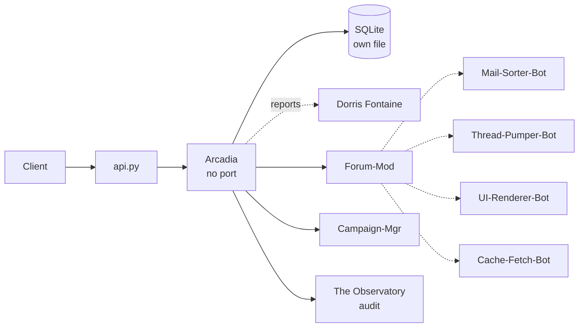

# Solution Pack — Arcadia

> **PID-ARC · AID-ARC-01 · Commercial / Financial pillar**
>
> Generated by `scripts/build_solution_packs.py`. **DERIVED** sections are read
> from the registers named inline and are verifiable. **SCAFFOLD** sections are
> generated starting points shaped by those facts — drafts to accept or replace,
> not descriptions of what exists.

## 1. What this is — DERIVED

| Field | Value | Source |
|---|---|---|
| Location | Arcadia | `src/entities/platform.py` |
| Product ID | `PID-ARC` | `_assign_ids()` |
| Lead AI | Lilli SC (`AID-ARC-01`) | `src/entities/platform.py` |
| Base model tier | Tranc3 | `get_orchestration_tier()` |
| Job Description | Chief Community & Front-End Officer | `docs/governance/LOCATION-FUNCTIONS.md` |
| Pillar | Commercial / Financial | `Pillar` enum |
| Reports to Prime(s) | Dorris Fontaine | `primes` |
| Status | 🔧 Partial | `CLAUDE.md` service table |
| Code path | `web/` ✅ on disk | filesystem |
| Port | _unassigned_ | compose / `worker_port` |

**Role.** Front-end post-login, forum & email hub

## 2. What it does — DERIVED

**Primary function.** Post-Login User Frontend, Forum & Email Hub

**Abilities**
- Dynamic Dashboard: Renders personalized frontend.
- Integrated Comms Matrix: Centralizes forums/emails.

**Operating modes**

- *Online:* Primary web portal; live forum/email management.
- *Offline:* Read-only forums; drafted posts; local UI render.

The offline mode is a design constraint, not a footnote: it states what this
Location must still deliver when its upstreams are unreachable, and any
implementation that cannot honour it is incomplete regardless of test coverage.

## 3. Architectural requirements — DERIVED constraints, SCAFFOLD targets

**Hard constraints — these come from the estate, not from preference.**

- Runs in-process under `api.py` (path `web/`), so it *may*
  import from `src/` — but that also means it shares the backend's failure domain.
- **SQLite over shared state** — each worker owns its own database file (principle 1).
- **In-memory token-bucket rate limiting** — no external KV (principle 2).
- **Zero-cost posture** — no paid dependency may be introduced without funding sign-off.

**Non-functional targets — SCAFFOLD, set these against real measurements.**

| Attribute | Starting target | Why this number needs replacing |
|---|---|---|
| Health endpoint | `GET /health` < 200 ms | compose healthcheck already polls it |
| p95 latency | < 500 ms | placeholder — no load profile exists yet |
| Availability | 99% single-node | one chassis; see `deploy/CITADEL_OPERATIONS.md` §9 |
| Data durability | volume-backed + off-box backup | snapshots are not backups |

## 4. Design schematic — DERIVED topology



## 5. Blueprint — SCAFFOLD

| Layer | Component | Note |
|---|---|---|
| Ingress | in-process router | mounted in api.py |
| API | FastAPI app | `/health`, `/status`, domain routes |
| Domain | Forum-Mod + Campaign-Mgr | the two Agents below |
| Automation | Mail-Sorter-Bot, Thread-Pumper-Bot, UI-Renderer-Bot, Cache-Fetch-Bot | the four Bots below |
| Persistence | SQLite | volume not yet declared |
| Observability | structured JSON + W3C trace | `src/observability/tracing.py` |

## 6. Storyboard and schema — SCAFFOLD

A first-run journey, derived from the abilities above. Replace with the real
journey once a user has actually walked it.

```
1. Request arrives  →  api.py routes
2. Forum-Mod — Scans threads to flag policy issues/announcements.
3. Campaign-Mgr — Drafts automated system emails/notifications.
4. Bots fire: Mail-Sorter-Bot, Thread-Pumper-Bot, UI-Renderer-Bot, Cache-Fetch-Bot
5. Result persisted to SQLite; event emitted to The Observatory
6. Response returned with trace_id for correlation
```

**Proposed schema** — shaped by the abilities; not yet implemented.

```sql
CREATE TABLE IF NOT EXISTS arcadia_records (
    id           INTEGER PRIMARY KEY AUTOINCREMENT,
    record_id    TEXT NOT NULL UNIQUE,
    actor        TEXT,
    payload      TEXT NOT NULL,        -- JSON
    state        TEXT NOT NULL DEFAULT 'new',
    created_at   REAL NOT NULL,
    updated_at   REAL
);
CREATE INDEX IF NOT EXISTS idx_arcadia_state ON arcadia_records(state);

CREATE TABLE IF NOT EXISTS arcadia_audit (
    id           INTEGER PRIMARY KEY AUTOINCREMENT,
    record_id    TEXT NOT NULL,
    action       TEXT NOT NULL,
    actor        TEXT,
    at           REAL NOT NULL
);
```

## 7. Components — DERIVED

**Agents (Tier 4)**

| SID | Agent | Responsibility |
|---|---|---|
| `SID-ARC-01` | Forum-Mod | Scans threads to flag policy issues/announcements. |
| `SID-ARC-02` | Campaign-Mgr | Drafts automated system emails/notifications. |

**Bots (Tier 5)**

| NID | Bot | Responsibility |
|---|---|---|
| `NID-ARC-01` | Mail-Sorter-Bot | Categorizes and dispatches inbound emails. |
| `NID-ARC-02` | Thread-Pumper-Bot | Injects live forum updates into the UI. |
| `NID-ARC-03` | UI-Renderer-Bot | Translates local templates into responsive UI. |
| `NID-ARC-04` | Cache-Fetch-Bot | Grabs local media/templates to speed up loads. |

## 8. Design direction — SCAFFOLD

**Foundation.** No OSS foundation is recorded for this Location. Either one
should be chosen and added to CLAUDE.md, or the build-from-scratch decision
should be written down with its reasoning.

**Interface tone.** Commercial / Financial pillar. Surface the two Agents as the
primary verbs and keep the four Bots as background automation the user never
has to name.

## 9. Templates — SCAFFOLD

**Health response** (matches `to_health_meta()`):

```json
{
  "location": "Arcadia",
  "pillar": "Commercial / Financial",
  "lead_ai": "Lilli SC",
  "primes": ['Dorris Fontaine'],
  "status": "ok"
}
```

**Compose service:**

```yaml
  arcadia:
    build: { context: ., dockerfile: Dockerfile }
    environment: [ PORT=TBD ]
    ports: [ "TBD:TBD" ]
```

## 10. Epics and stories — SCAFFOLD

Sequenced against the readiness gaps below, so the first epic is whatever is
actually missing rather than a generic phase 1.

### Epic 1 — Declare the deployment

- As an operator, Arcadia has a `docker-compose.production.yml` service with an explicit `PORT`.
- As an operator, a named volume backs the SQLite file so restarts do not lose state.
- As an operator, a healthcheck polls `/health` and marks the container unhealthy on failure.

### Epic 2 — Implement the abilities

- As a user, I can exercise: Dynamic Dashboard.
- As a user, I can exercise: Integrated Comms Matrix.
- As an auditor, every action emits an Observatory event carrying `PID-ARC`.

### Epic 3 — Prove it works

- As a maintainer, `tests/` covers Arcadia's health, status and each ability.
- As a maintainer, the offline mode above is tested, not assumed.

## 11. Technical debt — DERIVED where evidenced

| Item | Evidence | Impact |
|---|---|---|
| No port assigned | `worker_port` is None and compose has none | Not independently deployable |
| No test files under the code path | filesystem check | Regressions land silently |
| Status is 🔧 Partial | CLAUDE.md service table | Partial — not production-complete |

## 12. Wireframe — SCAFFOLD

```
┌──────────────────────────────────────────────────────┐
│ Arcadia                                      PID-ARC │
├──────────────────────────────────────────────────────┤
│ Post-Login User Frontend, Forum & Email Hub          │
├──────────────────────────────────────────────────────┤
│  ▸ Forum-Mod                Scans threads to flag po │
│  ▸ Campaign-Mgr             Drafts automated system  │
├──────────────────────────────────────────────────────┤
│  bots: Mail-Sorter-Bot, Thread-Pumper-Bot, UI-Rende  │
├──────────────────────────────────────────────────────┤
│  [ health ]  [ status ]  routed by host              │
└──────────────────────────────────────────────────────┘
```

## 13. Prioritisation — DERIVED

**Criticality 1/10 · Readiness 3/10 → Defer — below median on both axes**

Classified against the estate's own medians (criticality 4, readiness
8 across all 43 Locations), not a fixed threshold — the two axes do not
share a scale, so one absolute cut-off would bucket almost everything together.

They are also kept separate rather than multiplied. Collapsing them would
double-count: status and dependency facts feed both terms, so the product
systematically ranks safe-and-unimportant above important-and-unfinished.

| Axis | Score | Reasons |
|---|---|---|
| Criticality | 1/10 | answers to 1 Prime(s) (+1) |
| Readiness | 3/10 | status 🔧 partial/migrating (+1); code path `web/` exists on disk (+2) |

## 14. Documentation — DERIVED

- `PLATFORM_ENTITIES.md` — canonical entry for PID-ARC
- `src/entities/platform.py` — `PLATFORM_ENTITIES["Arcadia"]`
- `docs/governance/LOCATION-FUNCTIONS.md` — Job Description
- `docs/governance/TRANCENDOS-MODELS-MATRIX.md` — base tier and variants
- `web/` — implementation
- `compliance/magna-carta/compliance/sector_profiles.yaml` — sector activation
