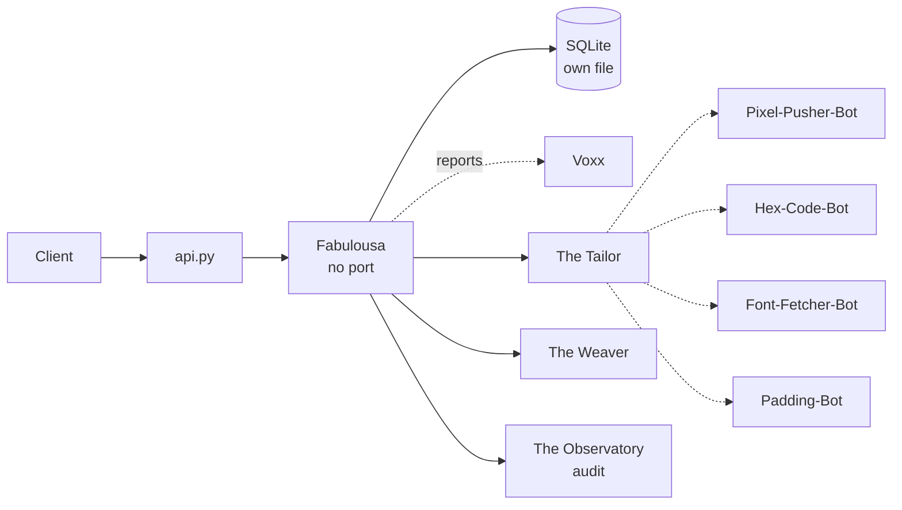

# Solution Pack — Fabulousa

> **PID-FAB · AID-FAB-01 · Creativity pillar**  
> Generated by `scripts/build_solution_packs.py`. **DERIVED** sections are read
> from the registers named inline and are verifiable. **SCAFFOLD** sections are
> generated starting points shaped by those facts — drafts to accept or replace,
> not descriptions of what exists.

## 1. What this is — DERIVED

| Field | Value | Source |
|---|---|---|
| Location | Fabulousa | `src/entities/platform.py` |
| Product ID | `PID-FAB` | `_assign_ids()` |
| Lead AI | Baron Von Hilton (`AID-FAB-01`) | `src/entities/platform.py` |
| Base model tier | Tranc3 | `get_orchestration_tier()` |
| Job Description | Chief Design Officer | `docs/governance/LOCATION-FUNCTIONS.md` |
| Pillar | Creativity | `Pillar` enum |
| Reports to Prime(s) | Voxx | `primes` |
| Status | ✅ In repo | `CLAUDE.md` service table |
| Code path | `src/studio/` ✅ on disk | filesystem |
| Port | _unassigned_ | compose / `worker_port` |
| OSS foundation | `penpot/penpot` (35K★, MPL 2.0) | CLAUDE.md |

**Role.** Styling, UX, UI & design center

## 2. What it does — DERIVED

**Primary function.** Styling, UX, UI & Design Center

**Abilities**
- Omni-Channel Styling: Generates UX/UI systems.
- Hyper-Fidelity Prototyping: Builds interactive UI mockups.

**Operating modes**

- *Online:* Live high-fidelity prototyping; styling engine execution.
- *Offline:* Local design drafting; low-res previews of tailored UI.

The offline mode is a design constraint, not a footnote: it states what this
Location must still deliver when its upstreams are unreachable, and any
implementation that cannot honour it is incomplete regardless of test coverage.

## 3. Architectural requirements — DERIVED constraints, SCAFFOLD targets

**Hard constraints — these come from the estate, not from preference.**

- Runs in-process under `api.py` (path `src/studio/`), so it *may*
  import from `src/` — but that also means it shares the backend's failure domain.
- **SQLite over shared state** — each worker owns its own database file (principle 1).
- **In-memory token-bucket rate limiting** — no external KV (principle 2).
- **Zero-cost posture** — no paid dependency may be introduced without funding sign-off.

**Non-functional targets — SCAFFOLD, set these against real measurements.**

| Attribute | Starting target | Why this number needs replacing |
|---|---|---|
| Health endpoint | `GET /health` < 200 ms | compose healthcheck already polls it |
| p95 latency | < 500 ms | placeholder — no load profile exists yet |
| Availability | 99% single-node | one chassis; see `deploy/CITADEL_OPERATIONS.md` §9 |
| Data durability | volume-backed + off-box backup | snapshots are not backups |

## 4. Design schematic — DERIVED topology



## 5. Blueprint — SCAFFOLD

| Layer | Component | Note |
|---|---|---|
| Ingress | in-process router | mounted in api.py |
| API | FastAPI app | `/health`, `/status`, domain routes |
| Domain | The Tailor + The Weaver | the two Agents below |
| Automation | Pixel-Pusher-Bot, Hex-Code-Bot, Font-Fetcher-Bot, Padding-Bot | the four Bots below |
| Persistence | SQLite | volume not yet declared |
| Observability | structured JSON + W3C trace | `src/observability/tracing.py` |

## 6. Storyboard and schema — SCAFFOLD

A first-run journey, derived from the abilities above. Replace with the real
journey once a user has actually walked it.

```
1. Request arrives  →  api.py routes
2. The Tailor — Adapts interface layouts/fonts based on user profiles.
3. The Weaver — Converts visual mockups into clean HTML/CSS/components.
4. Bots fire: Pixel-Pusher-Bot, Hex-Code-Bot, Font-Fetcher-Bot, Padding-Bot
5. Result persisted to SQLite; event emitted to The Observatory
6. Response returned with trace_id for correlation
```

**Proposed schema** — shaped by the abilities; not yet implemented.

```sql
CREATE TABLE IF NOT EXISTS fabulousa_records (
    id           INTEGER PRIMARY KEY AUTOINCREMENT,
    record_id    TEXT NOT NULL UNIQUE,
    actor        TEXT,
    payload      TEXT NOT NULL,        -- JSON
    state        TEXT NOT NULL DEFAULT 'new',
    created_at   REAL NOT NULL,
    updated_at   REAL
);
CREATE INDEX IF NOT EXISTS idx_fabulousa_state ON fabulousa_records(state);

CREATE TABLE IF NOT EXISTS fabulousa_audit (
    id           INTEGER PRIMARY KEY AUTOINCREMENT,
    record_id    TEXT NOT NULL,
    action       TEXT NOT NULL,
    actor        TEXT,
    at           REAL NOT NULL
);
```

## 7. Components — DERIVED

**Agents (Tier 4)**

| SID | Agent | Responsibility |
|---|---|---|
| `SID-FAB-01` | The Tailor | Adapts interface layouts/fonts based on user profiles. |
| `SID-FAB-02` | The Weaver | Converts visual mockups into clean HTML/CSS/components. |

**Bots (Tier 5)**

| NID | Bot | Responsibility |
|---|---|---|
| `NID-FAB-01` | Pixel-Pusher-Bot | Adjusts components to the pixel for visual alignment. |
| `NID-FAB-02` | Hex-Code-Bot | Verifies color accuracy and dynamic CSS themes. |
| `NID-FAB-03` | Font-Fetcher-Bot | Loads and handles web typography assets/fallbacks. |
| `NID-FAB-04` | Padding-Bot | Calculates margins and responsive flex properties. |

## 8. Design direction — SCAFFOLD

**Foundation.** `penpot/penpot` (35K★, MPL 2.0) is the vetted
starting point recorded in CLAUDE.md. Check the licence against the zero-cost
posture before adopting — self-host-free is not the same as permissive.

**Interface tone.** Creativity pillar. Surface the two Agents as the
primary verbs and keep the four Bots as background automation the user never
has to name.

## 9. Templates — SCAFFOLD

**Health response** (matches `to_health_meta()`):

```json
{
  "location": "Fabulousa",
  "pillar": "Creativity",
  "lead_ai": "Baron Von Hilton",
  "primes": ['Voxx'],
  "status": "ok"
}
```

**Compose service:**

```yaml
  fabulousa:
    build: { context: ., dockerfile: Dockerfile }
    environment: [ PORT=TBD ]
    ports: [ "TBD:TBD" ]
```

## 10. Epics and stories — SCAFFOLD

Sequenced against the readiness gaps below, so the first epic is whatever is
actually missing rather than a generic phase 1.

### Epic 1 — Declare the deployment

- As an operator, Fabulousa has a `docker-compose.production.yml` service with an explicit `PORT`.
- As an operator, a named volume backs the SQLite file so restarts do not lose state.
- As an operator, a healthcheck polls `/health` and marks the container unhealthy on failure.

### Epic 2 — Implement the abilities

- As a user, I can exercise: Omni-Channel Styling.
- As a user, I can exercise: Hyper-Fidelity Prototyping.
- As an auditor, every action emits an Observatory event carrying `PID-FAB`.

### Epic 3 — Prove it works

- As a maintainer, `tests/` covers Fabulousa's health, status and each ability.
- As a maintainer, the offline mode above is tested, not assumed.

## 11. Technical debt — DERIVED where evidenced

| Item | Evidence | Impact |
|---|---|---|
| No port assigned | `worker_port` is None and compose has none | Not independently deployable |
| No test files under the code path | filesystem check | Regressions land silently |

## 12. Wireframe — SCAFFOLD

```
┌──────────────────────────────────────────────────────┐
│ Fabulousa                                    PID-FAB │
├──────────────────────────────────────────────────────┤
│ Styling, UX, UI & Design Center                      │
├──────────────────────────────────────────────────────┤
│  ▸ The Tailor               Adapts interface layouts│
│  ▸ The Weaver               Converts visual mockups │
├──────────────────────────────────────────────────────┤
│  bots: Pixel-Pusher-Bot, Hex-Code-Bot, Font-Fetcher │
├──────────────────────────────────────────────────────┤
│  [ health ]  [ status ]  route /fabulousa           │
└──────────────────────────────────────────────────────┘
```

## 13. Prioritisation — DERIVED

**Criticality 1/10 · Readiness 7/10 → Defer — below median on both axes**

Classified against the estate's own medians (criticality 3, readiness
8 across all 43 Locations), not a fixed threshold — the two axes do not
share a scale, so one absolute cut-off would bucket almost everything together.

They are also kept separate rather than multiplied. Collapsing them would
double-count: status and dependency facts feed both terms, so the product
systematically ranks safe-and-unimportant above important-and-unfinished.

| Axis | Score | Reasons |
|---|---|---|
| Criticality | 1/10 | answers to 1 Prime(s) (+1) |
| Readiness | 7/10 | status ✅ in CLAUDE.md (+3); code path `src/studio/` exists on disk (+2); 3 Python files present (+2) |

## 14. Documentation — DERIVED

- `PLATFORM_ENTITIES.md` — canonical entry for PID-FAB
- `src/entities/platform.py` — `PLATFORM_ENTITIES["Fabulousa"]`
- `docs/governance/LOCATION-FUNCTIONS.md` — Job Description
- `docs/governance/TRANCENDOS-MODELS-MATRIX.md` — base tier and variants
- `src/studio/` — implementation
- `compliance/magna-carta/compliance/sector_profiles.yaml` — sector activation

