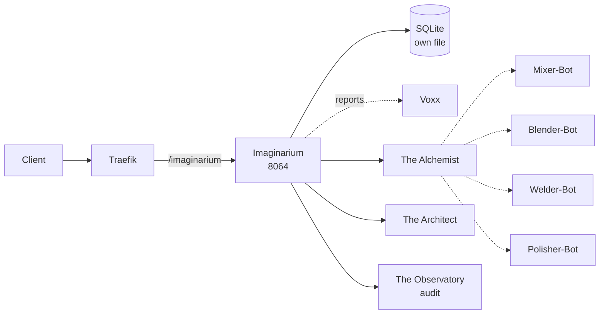

# Solution Pack — Imaginarium

> **PID-IMG · AID-IMG-01 · Creativity pillar**  
> Generated by `scripts/build_solution_packs.py`. **DERIVED** sections are read
> from the registers named inline and are verifiable. **SCAFFOLD** sections are
> generated starting points shaped by those facts — drafts to accept or replace,
> not descriptions of what exists.

## 1. What this is — DERIVED

| Field | Value | Source |
|---|---|---|
| Location | Imaginarium | `src/entities/platform.py` |
| Product ID | `PID-IMG` | `_assign_ids()` |
| Lead AI | Voxx (`AID-IMG-01`) | `src/entities/platform.py` |
| Base model tier | T2ance | `get_orchestration_tier()` |
| Job Description | Chief Creative Orchestration Officer | `docs/governance/LOCATION-FUNCTIONS.md` |
| Pillar | Creativity | `Pillar` enum |
| Reports to Prime(s) | Voxx | `primes` |
| Status | ✅ In repo | `CLAUDE.md` service table |
| Code path | `workers/imaginarium/` ✅ on disk | filesystem |
| Port | 8064 | compose / `worker_port` |
| Compose service | `imaginarium` | `docker-compose.production.yml` |
| Traefik route | `Host(`imaginarium.trancendos.com`) && PathPrefix(`/imaginarium`)` | compose labels |
| Rollout priority | P3 | CLAUDE.md worker map |

**Role.** Omni-creative masterpiece wizard (Fabulousa + TateKing + TranceFlow + Studio + Photo)

## 2. What it does — DERIVED

**Primary function.** Omni-Creative Masterpiece Wizard

**Abilities**
- Masterpiece Synthesis: Orchestrates creative tools.
- Feature Alchemy: Wires assets/code via natural language.

**Operating modes**

- *Online:* Live masterpiece generation; interactive feature mapping.
- *Offline:* Offline blueprint drafting; localized logic mapping.

The offline mode is a design constraint, not a footnote: it states what this
Location must still deliver when its upstreams are unreachable, and any
implementation that cannot honour it is incomplete regardless of test coverage.

## 3. Architectural requirements — DERIVED constraints, SCAFFOLD targets

**Hard constraints — these come from the estate, not from preference.**

- **Build context is `./workers/imaginarium`**, so `src/` is *not* in the image. This Location
  cannot `from src.* import ...` — ported logic must be self-contained. This is the
  single most common cause of a worker that passes tests and dies in the container.
- **SQLite over shared state** — each worker owns its own database file (principle 1).
- **In-memory token-bucket rate limiting** — no external KV (principle 2).
- **Zero-cost posture** — no paid dependency may be introduced without funding sign-off.
- **Traefik `stripprefix` is mandatory** for `/imaginarium` routing; without the middleware
  the router matches and the worker 404s on every path. This has bitten the estate
  before (resonate, imind).

**Non-functional targets — SCAFFOLD, set these against real measurements.**

| Attribute | Starting target | Why this number needs replacing |
|---|---|---|
| Health endpoint | `GET /health` < 200 ms | compose healthcheck already polls it |
| p95 latency | < 500 ms | placeholder — no load profile exists yet |
| Availability | 99% single-node | one chassis; see `deploy/CITADEL_OPERATIONS.md` §9 |
| Data durability | volume-backed + off-box backup | snapshots are not backups |

## 4. Design schematic — DERIVED topology



## 5. Blueprint — SCAFFOLD

| Layer | Component | Note |
|---|---|---|
| Ingress | Traefik → imaginarium | Host(`imaginarium.trancendos.com`) && PathPrefix(`/imaginarium`) |
| API | FastAPI app | `/health`, `/status`, domain routes |
| Domain | The Alchemist + The Architect | the two Agents below |
| Automation | Mixer-Bot, Blender-Bot, Welder-Bot, Polisher-Bot | the four Bots below |
| Persistence | SQLite | imaginarium-data → /app/data |
| Observability | structured JSON + W3C trace | `src/observability/tracing.py` |

## 6. Storyboard and schema — SCAFFOLD

A first-run journey, derived from the abilities above. Replace with the real
journey once a user has actually walked it.

```
1. Request arrives  →  Traefik strips /imaginarium
2. The Alchemist — Translates product plans into multi-app design sequences.
3. The Architect — Bridges visual layouts with structural code bindings.
4. Bots fire: Mixer-Bot, Blender-Bot, Welder-Bot, Polisher-Bot
5. Result persisted to SQLite; event emitted to The Observatory
6. Response returned with trace_id for correlation
```

**Proposed schema** — shaped by the abilities; not yet implemented.

```sql
CREATE TABLE IF NOT EXISTS imaginarium_records (
    id           INTEGER PRIMARY KEY AUTOINCREMENT,
    record_id    TEXT NOT NULL UNIQUE,
    actor        TEXT,
    payload      TEXT NOT NULL,        -- JSON
    state        TEXT NOT NULL DEFAULT 'new',
    created_at   REAL NOT NULL,
    updated_at   REAL
);
CREATE INDEX IF NOT EXISTS idx_imaginarium_state ON imaginarium_records(state);

CREATE TABLE IF NOT EXISTS imaginarium_audit (
    id           INTEGER PRIMARY KEY AUTOINCREMENT,
    record_id    TEXT NOT NULL,
    action       TEXT NOT NULL,
    actor        TEXT,
    at           REAL NOT NULL
);
```

## 7. Components — DERIVED

**Agents (Tier 4)**

| SID | Agent | Responsibility |
|---|---|---|
| `SID-IMG-01` | The Alchemist | Translates product plans into multi-app design sequences. |
| `SID-IMG-02` | The Architect | Bridges visual layouts with structural code bindings. |

**Bots (Tier 5)**

| NID | Bot | Responsibility |
|---|---|---|
| `NID-IMG-01` | Mixer-Bot | Groups images, media, and 3D files into unified folders. |
| `NID-IMG-02` | Blender-Bot | Resolves layer conflicts when combining 2D, 3D, and UI. |
| `NID-IMG-03` | Welder-Bot | Links user input triggers in the UI directly to backend functions. |
| `NID-IMG-04` | Polisher-Bot | Runs final visual sweeps on lighting, styling, and alignment. |

## 8. Design direction — SCAFFOLD

**Foundation.** No OSS foundation is recorded for this Location. Either one
should be chosen and added to CLAUDE.md, or the build-from-scratch decision
should be written down with its reasoning.

**Interface tone.** Creativity pillar. Surface the two Agents as the
primary verbs and keep the four Bots as background automation the user never
has to name.

## 9. Templates — SCAFFOLD

**Health response** (matches `to_health_meta()`):

```json
{
  "location": "Imaginarium",
  "pillar": "Creativity",
  "lead_ai": "Voxx",
  "primes": ['Voxx'],
  "status": "ok"
}
```

**Compose service:**

```yaml
  imaginarium:
    build: { context: ./workers/imaginarium, dockerfile: Dockerfile }
    environment: [ PORT=8064 ]
    ports: [ "8064:8064" ]
    labels:
      - "traefik.http.routers.imaginarium.middlewares=strip-imaginarium@docker"
      - "traefik.http.middlewares.strip-imaginarium.stripprefix.prefixes=/imaginarium"
```

## 10. Epics and stories — SCAFFOLD

Sequenced against the readiness gaps below, so the first epic is whatever is
actually missing rather than a generic phase 1.

### Epic 1 — Verify routing end to end

- As a client, requests to `/imaginarium` reach the worker with the prefix stripped.
- As a reviewer, a stripprefix middleware exists and is referenced by the router.

### Epic 2 — Implement the abilities

- As a user, I can exercise: Masterpiece Synthesis.
- As a user, I can exercise: Feature Alchemy.
- As an auditor, every action emits an Observatory event carrying `PID-IMG`.

### Epic 3 — Prove it works

- As a maintainer, `tests/` covers Imaginarium's health, status and each ability.
- As a maintainer, the offline mode above is tested, not assumed.

## 11. Technical debt — DERIVED where evidenced

| Item | Evidence | Impact |
|---|---|---|
| No test files under the code path | filesystem check | Regressions land silently |
| No OSS foundation recorded | CLAUDE.md foundations table | Build-vs-adopt decision is undocumented |

## 12. Wireframe — SCAFFOLD

```
┌──────────────────────────────────────────────────────┐
│ Imaginarium                                  PID-IMG │
├──────────────────────────────────────────────────────┤
│ Omni-Creative Masterpiece Wizard                     │
├──────────────────────────────────────────────────────┤
│  ▸ The Alchemist            Translates product plans│
│  ▸ The Architect            Bridges visual layouts w│
├──────────────────────────────────────────────────────┤
│  bots: Mixer-Bot, Blender-Bot, Welder-Bot, Polisher │
├──────────────────────────────────────────────────────┤
│  [ health ]  [ status ]  route /imaginarium         │
└──────────────────────────────────────────────────────┘
```

## 13. Prioritisation — DERIVED

**Criticality 7/10 · Readiness 8/10 → Invest — above-median dependency, below-median readiness**

Classified against the estate's own medians (criticality 3, readiness
8 across all 43 Locations), not a fixed threshold — the two axes do not
share a scale, so one absolute cut-off would bucket almost everything together.

They are also kept separate rather than multiplied. Collapsing them would
double-count: status and dependency facts feed both terms, so the product
systematically ranks safe-and-unimportant above important-and-unfinished.

**4 other Location(s) name this one's AI as their Prime.** An outage
here is not local.

| Axis | Score | Reasons |
|---|---|---|
| Criticality | 7/10 | worker-map priority P3 (+1); 4 Location(s) name this one's AI as their Prime (+4); answers to 1 Prime(s) (+1); externally routed via Traefik (+1) |
| Readiness | 8/10 | status ✅ in CLAUDE.md (+3); code path `workers/imaginarium/` exists on disk (+2); at least one Python file present (+1); compose service `imaginarium` defined (+2) |

## 14. Documentation — DERIVED

- `PLATFORM_ENTITIES.md` — canonical entry for PID-IMG
- `src/entities/platform.py` — `PLATFORM_ENTITIES["Imaginarium"]`
- `docs/governance/LOCATION-FUNCTIONS.md` — Job Description
- `docs/governance/TRANCENDOS-MODELS-MATRIX.md` — base tier and variants
- `docker-compose.production.yml` — service `imaginarium`
- `workers/imaginarium/` — implementation
- `compliance/magna-carta/compliance/sector_profiles.yaml` — sector activation

