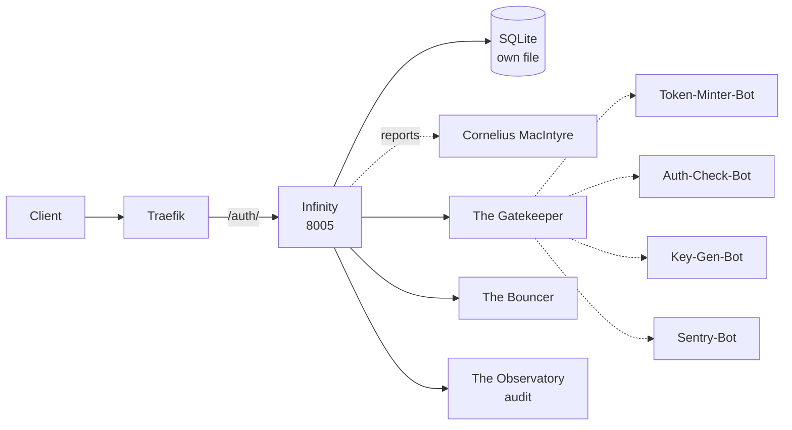

# Solution Pack — Infinity

> **PID-INF · AID-INF-01 · Security pillar**
>
> Generated by `scripts/build_solution_packs.py`. **DERIVED** sections are read
> from the registers named inline and are verifiable. **SCAFFOLD** sections are
> generated starting points shaped by those facts — drafts to accept or replace,
> not descriptions of what exists.

## 1. What this is — DERIVED

| Field | Value | Source |
|---|---|---|
| Location | Infinity | `src/entities/platform.py` |
| Product ID | `PID-INF` | `_assign_ids()` |
| Lead AI | The Guardian (Marcus Magnolia) (`AID-INF-01`) | `src/entities/platform.py` |
| All Lead AIs | The Guardian (Marcus Magnolia), The Orb of Orisis | `lead_ais` |
| Base model tier | T2ance | `get_orchestration_tier()` |
| Job Description | Chief Identity & Access Officer | `docs/governance/LOCATION-FUNCTIONS.md` |
| Pillar | Security | `Pillar` enum |
| Reports to Prime(s) | Cornelius MacIntyre | `primes` |
| Status | ✅ Self-hosted | `CLAUDE.md` service table |
| Code path | `workers/infinity-auth/` ✅ on disk | filesystem |
| Port | 8005 | compose / `worker_port` |
| Compose service | `infinity-auth` | `docker-compose.production.yml` |
| Traefik route | ``Host(`api.trancendos.com`) && PathPrefix(`/auth/`)`` | compose labels |
| Rollout priority | P0 | CLAUDE.md worker map |

**Role.** OAuth, SSO, central user management (1 account, all services)

## 2. What it does — DERIVED

**Primary function.** Centralized Auth, Edge Auth (OAuth 2.0) & User Transfer

**Abilities**
- Predictive Threat Modeling: Orb provides 'Future Sight.'
- Quantum Access Tokens: Expiring tokens for user transfer.

**Operating modes**

- *Online:* Live Central Auth; Edge Auth; predictive threat monitoring.
- *Offline:* Cached authentication; localized biometric app login.

The offline mode is a design constraint, not a footnote: it states what this
Location must still deliver when its upstreams are unreachable, and any
implementation that cannot honour it is incomplete regardless of test coverage.

## 3. Architectural requirements — DERIVED constraints, SCAFFOLD targets

**Hard constraints — these come from the estate, not from preference.**

- **Build context is `.`** (the repo root), so `src/` *is* in the image and
  this worker's Dockerfile may COPY from it. Narrowing the context to the worker
  directory would break the build — check the Dockerfile before changing it.
- **SQLite over shared state** — each worker owns its own database file (principle 1).
- **In-memory token-bucket rate limiting** — no external KV (principle 2).
- **Zero-cost posture** — no paid dependency may be introduced without funding sign-off.
- **No `stripprefix` on `/auth/`, and none is needed** — verified,
  because this worker's own source registers paths under it, so the prefix must reach
  it intact. Adding the middleware would break it.

**Non-functional targets — SCAFFOLD, set these against real measurements.**

| Attribute | Starting target | Why this number needs replacing |
|---|---|---|
| Health endpoint | `GET /health` < 200 ms | compose healthcheck already polls it |
| p95 latency | < 500 ms | placeholder — no load profile exists yet |
| Availability | 99% single-node | one chassis; see `deploy/CITADEL_OPERATIONS.md` §9 |
| Data durability | volume-backed + off-box backup | snapshots are not backups |

## 4. Design schematic — DERIVED topology



## 5. Blueprint — SCAFFOLD

| Layer | Component | Note |
|---|---|---|
| Ingress | Traefik → /auth/ | ``Host(`api.trancendos.com`) && PathPrefix(`/auth/`)`` |
| API | FastAPI app | `/health`, `/status`, domain routes |
| Domain | The Gatekeeper + The Bouncer | the two Agents below |
| Automation | Token-Minter-Bot, Auth-Check-Bot, Key-Gen-Bot, Sentry-Bot | the four Bots below |
| Persistence | SQLite | auth-data → /data |
| Observability | structured JSON + W3C trace | `src/observability/tracing.py` |

## 6. Storyboard and schema — SCAFFOLD

A first-run journey, derived from the abilities above. Replace with the real
journey once a user has actually walked it.

```
1. Request arrives  →  Traefik forwards /auth/ unchanged (no stripprefix)
2. The Gatekeeper — Checks incoming user logins, issuing secure, temporary keys.
3. The Bouncer — Monitors login origins and activities, blocking suspicious IPs.
4. Bots fire: Token-Minter-Bot, Auth-Check-Bot, Key-Gen-Bot, Sentry-Bot
5. Result persisted to SQLite; event emitted to The Observatory
6. Response returned with trace_id for correlation
```

**Proposed schema** — shaped by the abilities; not yet implemented.

```sql
CREATE TABLE IF NOT EXISTS infinity_records (
    id           INTEGER PRIMARY KEY AUTOINCREMENT,
    record_id    TEXT NOT NULL UNIQUE,
    actor        TEXT,
    payload      TEXT NOT NULL,        -- JSON
    state        TEXT NOT NULL DEFAULT 'new',
    created_at   REAL NOT NULL,
    updated_at   REAL
);
CREATE INDEX IF NOT EXISTS idx_infinity_state ON infinity_records(state);

CREATE TABLE IF NOT EXISTS infinity_audit (
    id           INTEGER PRIMARY KEY AUTOINCREMENT,
    record_id    TEXT NOT NULL,
    action       TEXT NOT NULL,
    actor        TEXT,
    at           REAL NOT NULL
);
```

## 7. Components — DERIVED

**Agents (Tier 4)**

| SID | Agent | Responsibility |
|---|---|---|
| `SID-INF-01` | The Gatekeeper | Checks incoming user logins, issuing secure, temporary keys. |
| `SID-INF-02` | The Bouncer | Monitors login origins and activities, blocking suspicious IPs. |

**Bots (Tier 5)**

| NID | Bot | Responsibility |
|---|---|---|
| `NID-INF-01` | Token-Minter-Bot | Generates secure, time-limited tokens for node-crossing users. |
| `NID-INF-02` | Auth-Check-Bot | Verifies active user permissions before unlocking private features. |
| `NID-INF-03` | Key-Gen-Bot | Handles local encryption keys to authorize offline applications. |
| `NID-INF-04` | Sentry-Bot | Logs security events, highlighting failed login attempts. |

**Per-Lead-AI agent teams** — this Location runs a dedicated pair per named AI.

| Lead AI | Alpha | Beta |
|---|---|---|
| The Guardian (Marcus Magnolia) | The Gatekeeper | The Bouncer |
| The Orb of Orisis | The Seer | The Cartographer |

## 8. Design direction — SCAFFOLD

**Foundation.** No OSS foundation is recorded for this Location. Either one
should be chosen and added to CLAUDE.md, or the build-from-scratch decision
should be written down with its reasoning.

**Interface tone.** Security pillar. Surface the two Agents as the
primary verbs and keep the four Bots as background automation the user never
has to name.

## 9. Templates — SCAFFOLD

**Health response** (matches `to_health_meta()`):

```json
{
  "location": "Infinity",
  "pillar": "Security",
  "lead_ai": "The Guardian (Marcus Magnolia)",
  "primes": ['Cornelius MacIntyre'],
  "status": "ok"
}
```

**Compose service:**

```yaml
  infinity-auth:
    build: { context: ., dockerfile: workers/infinity-auth/Dockerfile }
    environment: [ PORT=8005 ]
    ports: [ "8005:8005" ]
    labels:
      - "traefik.http.routers.infinity-auth.rule=Host(`api.trancendos.com`) && PathPrefix(`/auth/`)"
```

## 10. Epics and stories — SCAFFOLD

Sequenced against the readiness gaps below, so the first epic is whatever is
actually missing rather than a generic phase 1.

### Epic 1 — Verify routing end to end

- As a client, requests to `/auth/` reach the worker with the prefix intact, which is what its own routes expect.
- As a reviewer, NO stripprefix middleware is attached — adding one would break every route.

### Epic 2 — Implement the abilities

- As a user, I can exercise: Predictive Threat Modeling.
- As a user, I can exercise: Quantum Access Tokens.
- As an auditor, every action emits an Observatory event carrying `PID-INF`.

## 11. Technical debt — DERIVED where evidenced

| Item | Evidence | Impact |
|---|---|---|
| Two candidate implementations: registered `workers/infinity-auth/` vs `workers/infinity-portal-service/` | both directories exist on disk | Registry and CLAUDE.md name different workers for this Location — port, route and readiness above follow the registered one |

## 12. Wireframe — SCAFFOLD

```
┌──────────────────────────────────────────────────────┐
│ Infinity                                     PID-INF │
├──────────────────────────────────────────────────────┤
│ Centralized Auth, Edge Auth (OAuth 2.0) & User Trans │
├──────────────────────────────────────────────────────┤
│  ▸ The Gatekeeper           Checks incoming user log │
│  ▸ The Bouncer              Monitors login origins a │
├──────────────────────────────────────────────────────┤
│  bots: Token-Minter-Bot, Auth-Check-Bot, Key-Gen-Bo  │
├──────────────────────────────────────────────────────┤
│  [ health ]  [ status ]  route /auth/                │
└──────────────────────────────────────────────────────┘
```

## 13. Prioritisation — DERIVED

**Criticality 10/10 · Readiness 10/10 → Finish first — above-median dependency, above-median readiness**

Classified against the estate's own medians (criticality 4, readiness
8 across all 43 Locations), not a fixed threshold — the two axes do not
share a scale, so one absolute cut-off would bucket almost everything together.

They are also kept separate rather than multiplied. Collapsing them would
double-count: status and dependency facts feed both terms, so the product
systematically ranks safe-and-unimportant above important-and-unfinished.

**5 other Location(s) name this one's AI as their Prime.** An outage
here is not local.

| Axis | Score | Reasons |
|---|---|---|
| Criticality | 10/10 | worker-map priority P0 (+5); 5 Location(s) name this one's AI as their Prime (+4); answers to 1 Prime(s) (+1); 2 Lead AIs — multi-team Location (+1); Security pillar — platform-wide blast radius (+2); externally routed via Traefik (+1) |
| Readiness | 10/10 | status ✅ in CLAUDE.md (+3); code path `workers/infinity-auth/` exists on disk (+2); three or more Python files present (+2); compose service `infinity-auth` defined (+2); at least one test file present (+1) |

## 14. Documentation — DERIVED

- `PLATFORM_ENTITIES.md` — canonical entry for PID-INF
- `src/entities/platform.py` — `PLATFORM_ENTITIES["Infinity"]`
- `docs/governance/LOCATION-FUNCTIONS.md` — Job Description
- `docs/governance/TRANCENDOS-MODELS-MATRIX.md` — base tier and variants
- `docker-compose.production.yml` — service `infinity-auth`
- `workers/infinity-auth/` — implementation
- `compliance/magna-carta/compliance/sector_profiles.yaml` — sector activation
