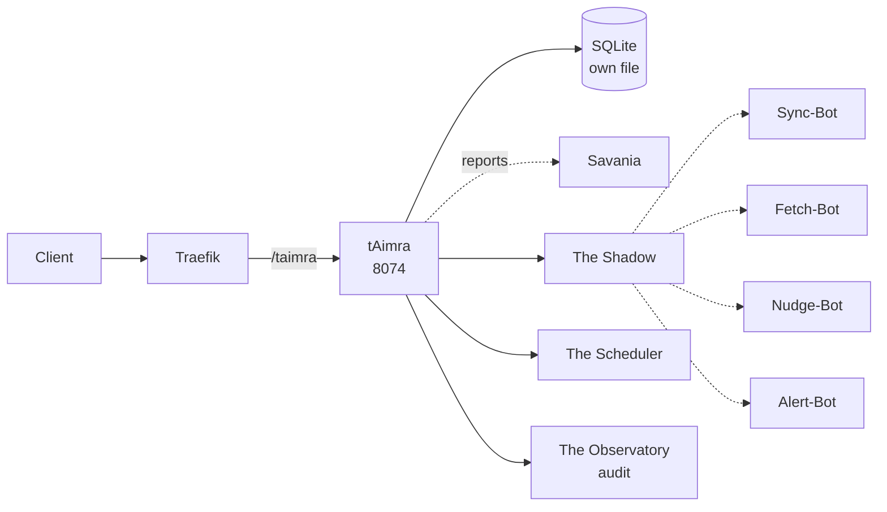

# Solution Pack — tAimra

> **PID-TMR · AID-TMR-01 · Wellbeing pillar**
>
> Generated by `scripts/build_solution_packs.py`. **DERIVED** sections are read
> from the registers named inline and are verifiable. **SCAFFOLD** sections are
> generated starting points shaped by those facts — drafts to accept or replace,
> not descriptions of what exists.

## 1. What this is — DERIVED

| Field | Value | Source |
|---|---|---|
| Location | tAimra | `src/entities/platform.py` |
| Product ID | `PID-TMR` | `_assign_ids()` |
| Lead AI | tAImra (`AID-TMR-01`) | `src/entities/platform.py` |
| Base model tier | Trance-One | `get_orchestration_tier()` |
| Job Description | Head of Digital Twin Services | `docs/governance/LOCATION-FUNCTIONS.md` |
| Pillar | Wellbeing | `Pillar` enum |
| Reports to Prime(s) | Savania | `primes` |
| Status | ✅ Self-hosted | `CLAUDE.md` service table |
| Code path | `workers/taimra/` ✅ on disk | filesystem |
| Port | 8074 | compose / `worker_port` |
| Compose service | `taimra` | `docker-compose.production.yml` |
| Traefik route | `Host(`taimra.trancendos.com`) && PathPrefix(`/taimra`)` | compose labels |
| Rollout priority | P3 | CLAUDE.md worker map |

**Role.** Opt-in digital twin & life assistant

## 2. What it does — DERIVED

**Primary function.** Opt-in Digital Twin System & Life Assistant

**Abilities**
- Biometric Sync: Ingests health data securely (HIPAA compliant).
- Proactive Life Assistance: Adjusts schedules to reduce friction.

**Operating modes**

- *Online:* Live API syncing with external wearables; real-time schedule management.
- *Offline:* Secure local caching of health metrics; offline schedule review.

The offline mode is a design constraint, not a footnote: it states what this
Location must still deliver when its upstreams are unreachable, and any
implementation that cannot honour it is incomplete regardless of test coverage.

## 3. Architectural requirements — DERIVED constraints, SCAFFOLD targets

**Hard constraints — these come from the estate, not from preference.**

- **Build context is `./workers/taimra`**, so `src/` is *not* in the image. This Location
  cannot `from src.* import ...` — ported logic must be self-contained. This is the
  single most common cause of a worker that passes tests and dies in the container.
- **SQLite over shared state** — each worker owns its own database file (principle 1).
- **In-memory token-bucket rate limiting** — no external KV (principle 2).
- **Zero-cost posture** — no paid dependency may be introduced without funding sign-off.
- **Traefik `stripprefix` is mandatory** for `/taimra` routing; without the middleware
  the router matches and the worker 404s on every path. This has bitten the estate
  before (resonate, imind).

**Non-functional targets — SCAFFOLD, set these against real measurements.**

| Attribute | Starting target | Why this number needs replacing |
|---|---|---|
| Health endpoint | `GET /health` < 200 ms | compose healthcheck already polls it |
| p95 latency | < 500 ms | placeholder — no load profile exists yet |
| Availability | 99% single-node | one chassis; see `deploy/CITADEL_OPERATIONS.md` §9 |
| Data durability | volume-backed + off-box backup | snapshots are not backups |

## 4. Design schematic — DERIVED topology



## 5. Blueprint — SCAFFOLD

| Layer | Component | Note |
|---|---|---|
| Ingress | Traefik → taimra | Host(`taimra.trancendos.com`) && PathPrefix(`/taimra`) |
| API | FastAPI app | `/health`, `/status`, domain routes |
| Domain | The Shadow + The Scheduler | the two Agents below |
| Automation | Sync-Bot, Fetch-Bot, Nudge-Bot, Alert-Bot | the four Bots below |
| Persistence | SQLite | taimra-data → /app/data |
| Observability | structured JSON + W3C trace | `src/observability/tracing.py` |

## 6. Storyboard and schema — SCAFFOLD

A first-run journey, derived from the abilities above. Replace with the real
journey once a user has actually walked it.

```
1. Request arrives  →  Traefik strips /taimra
2. The Shadow — Mirrors daily habits to anticipate system and scheduling preferences.
3. The Scheduler — Adjusts calendar priorities proactively to carve out required rest breaks.
4. Bots fire: Sync-Bot, Fetch-Bot, Nudge-Bot, Alert-Bot
5. Result persisted to SQLite; event emitted to The Observatory
6. Response returned with trace_id for correlation
```

**Proposed schema** — shaped by the abilities; not yet implemented.

```sql
CREATE TABLE IF NOT EXISTS taimra_records (
    id           INTEGER PRIMARY KEY AUTOINCREMENT,
    record_id    TEXT NOT NULL UNIQUE,
    actor        TEXT,
    payload      TEXT NOT NULL,        -- JSON
    state        TEXT NOT NULL DEFAULT 'new',
    created_at   REAL NOT NULL,
    updated_at   REAL
);
CREATE INDEX IF NOT EXISTS idx_taimra_state ON taimra_records(state);

CREATE TABLE IF NOT EXISTS taimra_audit (
    id           INTEGER PRIMARY KEY AUTOINCREMENT,
    record_id    TEXT NOT NULL,
    action       TEXT NOT NULL,
    actor        TEXT,
    at           REAL NOT NULL
);
```

## 7. Components — DERIVED

**Agents (Tier 4)**

| SID | Agent | Responsibility |
|---|---|---|
| `SID-TMR-01` | The Shadow | Mirrors daily habits to anticipate system and scheduling preferences. |
| `SID-TMR-02` | The Scheduler | Adjusts calendar priorities proactively to carve out required rest breaks. |

**Bots (Tier 5)**

| NID | Bot | Responsibility |
|---|---|---|
| `NID-TMR-01` | Sync-Bot | Pulls data securely from health platforms, applying strict HIPAA encryption. |
| `NID-TMR-02` | Fetch-Bot | Parses upcoming tasks to flag heavy scheduling days early for the user. |
| `NID-TMR-03` | Nudge-Bot | Sends gentle notifications suggesting stretches, hydration, or posture breaks. |
| `NID-TMR-04` | Alert-Bot | Warns users of upcoming tasks, giving them buffer time to finish current work. |

## 8. Design direction — SCAFFOLD

**Foundation.** No OSS foundation is recorded for this Location. Either one
should be chosen and added to CLAUDE.md, or the build-from-scratch decision
should be written down with its reasoning.

**Interface tone.** Wellbeing pillar. Surface the two Agents as the
primary verbs and keep the four Bots as background automation the user never
has to name.

## 9. Templates — SCAFFOLD

**Health response** (matches `to_health_meta()`):

```json
{
  "location": "tAimra",
  "pillar": "Wellbeing",
  "lead_ai": "tAImra",
  "primes": ['Savania'],
  "status": "ok"
}
```

**Compose service:**

```yaml
  taimra:
    build: { context: ./workers/taimra, dockerfile: Dockerfile }
    environment: [ PORT=8074 ]
    ports: [ "8074:8074" ]
    labels:
      - "traefik.http.routers.taimra.rule=Host(`taimra.trancendos.com`) && PathPrefix(`/taimra`)"
      - "traefik.http.routers.taimra.middlewares=strip-taimra@docker"
      - "traefik.http.middlewares.strip-taimra.stripprefix.prefixes=/taimra"
```

## 10. Epics and stories — SCAFFOLD

Sequenced against the readiness gaps below, so the first epic is whatever is
actually missing rather than a generic phase 1.

### Epic 1 — Verify routing end to end

- As a client, requests to `/taimra` reach the worker with the prefix stripped.
- As a reviewer, a stripprefix middleware exists and is referenced by the router.

### Epic 2 — Implement the abilities

- As a user, I can exercise: Biometric Sync.
- As a user, I can exercise: Proactive Life Assistance.
- As an auditor, every action emits an Observatory event carrying `PID-TMR`.

### Epic 3 — Prove it works

- As a maintainer, `tests/` covers tAimra's health, status and each ability.
- As a maintainer, the offline mode above is tested, not assumed.

## 11. Technical debt — DERIVED where evidenced

| Item | Evidence | Impact |
|---|---|---|
| No test files under the code path | filesystem check | Regressions land silently |

## 12. Wireframe — SCAFFOLD

```
┌──────────────────────────────────────────────────────┐
│ tAimra                                       PID-TMR │
├──────────────────────────────────────────────────────┤
│ Opt-in Digital Twin System & Life Assistant          │
├──────────────────────────────────────────────────────┤
│  ▸ The Shadow               Mirrors daily habits to │
│  ▸ The Scheduler            Adjusts calendar priorit│
├──────────────────────────────────────────────────────┤
│  bots: Sync-Bot, Fetch-Bot, Nudge-Bot, Alert-Bot    │
├──────────────────────────────────────────────────────┤
│  [ health ]  [ status ]  route /taimra              │
└──────────────────────────────────────────────────────┘
```

## 13. Prioritisation — DERIVED

**Criticality 3/10 · Readiness 8/10 → Defer — below median on both axes**

Classified against the estate's own medians (criticality 3, readiness
8 across all 43 Locations), not a fixed threshold — the two axes do not
share a scale, so one absolute cut-off would bucket almost everything together.

They are also kept separate rather than multiplied. Collapsing them would
double-count: status and dependency facts feed both terms, so the product
systematically ranks safe-and-unimportant above important-and-unfinished.

| Axis | Score | Reasons |
|---|---|---|
| Criticality | 3/10 | worker-map priority P3 (+1); answers to 1 Prime(s) (+1); externally routed via Traefik (+1) |
| Readiness | 8/10 | status ✅ in CLAUDE.md (+3); code path `workers/taimra/` exists on disk (+2); at least one Python file present (+1); compose service `taimra` defined (+2) |

## 14. Documentation — DERIVED

- `PLATFORM_ENTITIES.md` — canonical entry for PID-TMR
- `src/entities/platform.py` — `PLATFORM_ENTITIES["tAimra"]`
- `docs/governance/LOCATION-FUNCTIONS.md` — Job Description
- `docs/governance/TRANCENDOS-MODELS-MATRIX.md` — base tier and variants
- `docker-compose.production.yml` — service `taimra`
- `workers/taimra/` — implementation
- `compliance/magna-carta/compliance/sector_profiles.yaml` — sector activation
