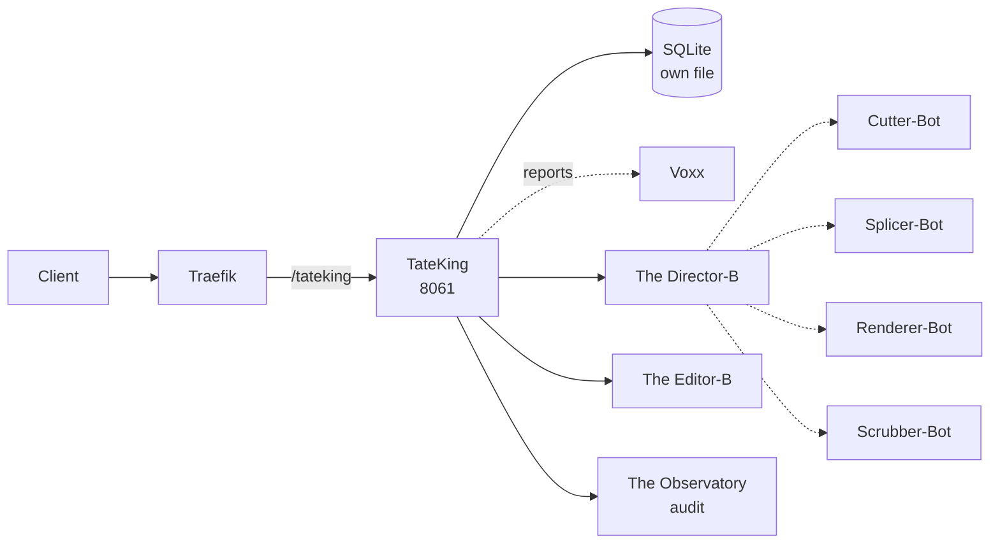

# Solution Pack — TateKing

> **PID-TKG · AID-TKG-01 · Creativity pillar**
>
> Generated by `scripts/build_solution_packs.py`. **DERIVED** sections are read
> from the registers named inline and are verifiable. **SCAFFOLD** sections are
> generated starting points shaped by those facts — drafts to accept or replace,
> not descriptions of what exists.

## 1. What this is — DERIVED

| Field | Value | Source |
|---|---|---|
| Location | TateKing | `src/entities/platform.py` |
| Product ID | `PID-TKG` | `_assign_ids()` |
| Lead AI | Benji Tate (`AID-TKG-01`) | `src/entities/platform.py` |
| All Lead AIs | Benji Tate, Sam King | `lead_ais` |
| Base model tier | Tranc3 | `get_orchestration_tier()` |
| Job Description | Head of Video Production | `docs/governance/LOCATION-FUNCTIONS.md` |
| Pillar | Creativity | `Pillar` enum |
| Reports to Prime(s) | Voxx | `primes` |
| Status | ✅ In repo | `CLAUDE.md` service table |
| Code path | `workers/tateking/` ✅ on disk | filesystem |
| Port | 8061 | compose / `worker_port` |
| Compose service | `tateking` | `docker-compose.production.yml` |
| Traefik route | `Host(`tateking.trancendos.com`) && PathPrefix(`/tateking`)` | compose labels |
| Rollout priority | P3 | CLAUDE.md worker map |

**Role.** Video creation & editing platform

## 2. What it does — DERIVED

**Primary function.** Video Creation & Editing Platform

**Abilities**
- Cloud-Native NLE: Browser-based video editing.
- Timeline-as-Code: Translates edits into code.

**Operating modes**

- *Online:* Cloud video production; distributed swarm rendering.
- *Offline:* Local timeline editing; low-res proxy rendering.

The offline mode is a design constraint, not a footnote: it states what this
Location must still deliver when its upstreams are unreachable, and any
implementation that cannot honour it is incomplete regardless of test coverage.

## 3. Architectural requirements — DERIVED constraints, SCAFFOLD targets

**Hard constraints — these come from the estate, not from preference.**

- **Build context is `./workers/tateking`**, so `src/` is *not* in the image. This Location
  cannot `from src.* import ...` — ported logic must be self-contained. This is the
  single most common cause of a worker that passes tests and dies in the container.
- **SQLite over shared state** — each worker owns its own database file (principle 1).
- **In-memory token-bucket rate limiting** — no external KV (principle 2).
- **Zero-cost posture** — no paid dependency may be introduced without funding sign-off.
- **Traefik `stripprefix` is mandatory** for `/tateking` routing; without the middleware
  the router matches and the worker 404s on every path. This has bitten the estate
  before (resonate, imind).

**Non-functional targets — SCAFFOLD, set these against real measurements.**

| Attribute | Starting target | Why this number needs replacing |
|---|---|---|
| Health endpoint | `GET /health` < 200 ms | compose healthcheck already polls it |
| p95 latency | < 500 ms | placeholder — no load profile exists yet |
| Availability | 99% single-node | one chassis; see `deploy/CITADEL_OPERATIONS.md` §9 |
| Data durability | volume-backed + off-box backup | snapshots are not backups |

## 4. Design schematic — DERIVED topology



## 5. Blueprint — SCAFFOLD

| Layer | Component | Note |
|---|---|---|
| Ingress | Traefik → /tateking | Host(`tateking.trancendos.com`) && PathPrefix(`/tateking`) |
| API | FastAPI app | `/health`, `/status`, domain routes |
| Domain | The Director-B + The Editor-B | the two Agents below |
| Automation | Cutter-Bot, Splicer-Bot, Renderer-Bot, Scrubber-Bot | the four Bots below |
| Persistence | SQLite | volume not yet declared |
| Observability | structured JSON + W3C trace | `src/observability/tracing.py` |

## 6. Storyboard and schema — SCAFFOLD

A first-run journey, derived from the abilities above. Replace with the real
journey once a user has actually walked it.

```
1. Request arrives  →  Traefik strips /tateking
2. The Director-B — Coordinates timeline-as-code scripting from video data.
3. The Editor-B — Suggests cuts, music shifts, and scene transitions.
4. Bots fire: Cutter-Bot, Splicer-Bot, Renderer-Bot, Scrubber-Bot
5. Result persisted to SQLite; event emitted to The Observatory
6. Response returned with trace_id for correlation
```

**Proposed schema** — shaped by the abilities; not yet implemented.

```sql
CREATE TABLE IF NOT EXISTS tateking_records (
    id           INTEGER PRIMARY KEY AUTOINCREMENT,
    record_id    TEXT NOT NULL UNIQUE,
    actor        TEXT,
    payload      TEXT NOT NULL,        -- JSON
    state        TEXT NOT NULL DEFAULT 'new',
    created_at   REAL NOT NULL,
    updated_at   REAL
);
CREATE INDEX IF NOT EXISTS idx_tateking_state ON tateking_records(state);

CREATE TABLE IF NOT EXISTS tateking_audit (
    id           INTEGER PRIMARY KEY AUTOINCREMENT,
    record_id    TEXT NOT NULL,
    action       TEXT NOT NULL,
    actor        TEXT,
    at           REAL NOT NULL
);
```

## 7. Components — DERIVED

**Agents (Tier 4)**

| SID | Agent | Responsibility |
|---|---|---|
| `SID-TKG-01` | The Director-B | Coordinates timeline-as-code scripting from video data. |
| `SID-TKG-02` | The Editor-B | Suggests cuts, music shifts, and scene transitions. |

**Bots (Tier 5)**

| NID | Bot | Responsibility |
|---|---|---|
| `NID-TKG-01` | Cutter-Bot | Slices video and audio tracks at precise timestamps. |
| `NID-TKG-02` | Splicer-Bot | Joins video clips and audio tracks into unified tracks. |
| `NID-TKG-03` | Renderer-Bot | Compresses/outputs video files into target formats. |
| `NID-TKG-04` | Scrubber-Bot | Generates fast, low-res preview frames for the timeline. |

**Per-Lead-AI agent teams** — this Location runs a dedicated pair per named AI.

| Lead AI | Alpha | Beta |
|---|---|---|
| Benji Tate | The Director-B | The Editor-B |
| Sam King | The Director-S | The Editor-S |

## 8. Design direction — SCAFFOLD

**Foundation.** No OSS foundation is recorded for this Location. Either one
should be chosen and added to CLAUDE.md, or the build-from-scratch decision
should be written down with its reasoning.

**Interface tone.** Creativity pillar. Surface the two Agents as the
primary verbs and keep the four Bots as background automation the user never
has to name.

## 9. Templates — SCAFFOLD

**Health response** (matches `to_health_meta()`):

```json
{
  "location": "TateKing",
  "pillar": "Creativity",
  "lead_ai": "Benji Tate",
  "primes": ['Voxx'],
  "status": "ok"
}
```

**Compose service:**

```yaml
  tateking:
    build: { context: ./workers/tateking, dockerfile: Dockerfile }
    environment: [ PORT=8061 ]
    ports: [ "8061:8061" ]
    labels:
      - "traefik.http.routers.tateking.rule=Host(`tateking.trancendos.com`) && PathPrefix(`/tateking`)"
      - "traefik.http.routers.tateking.middlewares=strip-tateking@docker"
      - "traefik.http.middlewares.strip-tateking.stripprefix.prefixes=/tateking"
```

## 10. Epics and stories — SCAFFOLD

Sequenced against the readiness gaps below, so the first epic is whatever is
actually missing rather than a generic phase 1.

### Epic 1 — Verify routing end to end

- As a client, requests to `/tateking` reach the worker with the prefix stripped.
- As a reviewer, a stripprefix middleware exists and is referenced by the router.

### Epic 2 — Implement the abilities

- As a user, I can exercise: Cloud-Native NLE.
- As a user, I can exercise: Timeline-as-Code.
- As an auditor, every action emits an Observatory event carrying `PID-TKG`.

### Epic 3 — Prove it works

- As a maintainer, `tests/` covers TateKing's health, status and each ability.
- As a maintainer, the offline mode above is tested, not assumed.

## 11. Technical debt — DERIVED where evidenced

| Item | Evidence | Impact |
|---|---|---|
| No test files under the code path | filesystem check | Regressions land silently |
| No OSS foundation recorded | CLAUDE.md foundations table | Build-vs-adopt decision is undocumented |

## 12. Wireframe — SCAFFOLD

```
┌──────────────────────────────────────────────────────┐
│ TateKing                                     PID-TKG │
├──────────────────────────────────────────────────────┤
│ Video Creation & Editing Platform                    │
├──────────────────────────────────────────────────────┤
│  ▸ The Director-B           Coordinates timeline-as-│
│  ▸ The Editor-B             Suggests cuts, music shi│
├──────────────────────────────────────────────────────┤
│  bots: Cutter-Bot, Splicer-Bot, Renderer-Bot, Scrub │
├──────────────────────────────────────────────────────┤
│  [ health ]  [ status ]  route /tateking            │
└──────────────────────────────────────────────────────┘
```

## 13. Prioritisation — DERIVED

**Criticality 4/10 · Readiness 8/10 → Defer — below median on both axes**

Classified against the estate's own medians (criticality 4, readiness
8 across all 43 Locations), not a fixed threshold — the two axes do not
share a scale, so one absolute cut-off would bucket almost everything together.

They are also kept separate rather than multiplied. Collapsing them would
double-count: status and dependency facts feed both terms, so the product
systematically ranks safe-and-unimportant above important-and-unfinished.

| Axis | Score | Reasons |
|---|---|---|
| Criticality | 4/10 | worker-map priority P3 (+1); answers to 1 Prime(s) (+1); 2 Lead AIs — multi-team Location (+1); externally routed via Traefik (+1) |
| Readiness | 8/10 | status ✅ in CLAUDE.md (+3); code path `workers/tateking/` exists on disk (+2); at least one Python file present (+1); compose service `tateking` defined (+2) |

## 14. Documentation — DERIVED

- `PLATFORM_ENTITIES.md` — canonical entry for PID-TKG
- `src/entities/platform.py` — `PLATFORM_ENTITIES["TateKing"]`
- `docs/governance/LOCATION-FUNCTIONS.md` — Job Description
- `docs/governance/TRANCENDOS-MODELS-MATRIX.md` — base tier and variants
- `docker-compose.production.yml` — service `tateking`
- `workers/tateking/` — implementation
- `compliance/magna-carta/compliance/sector_profiles.yaml` — sector activation
