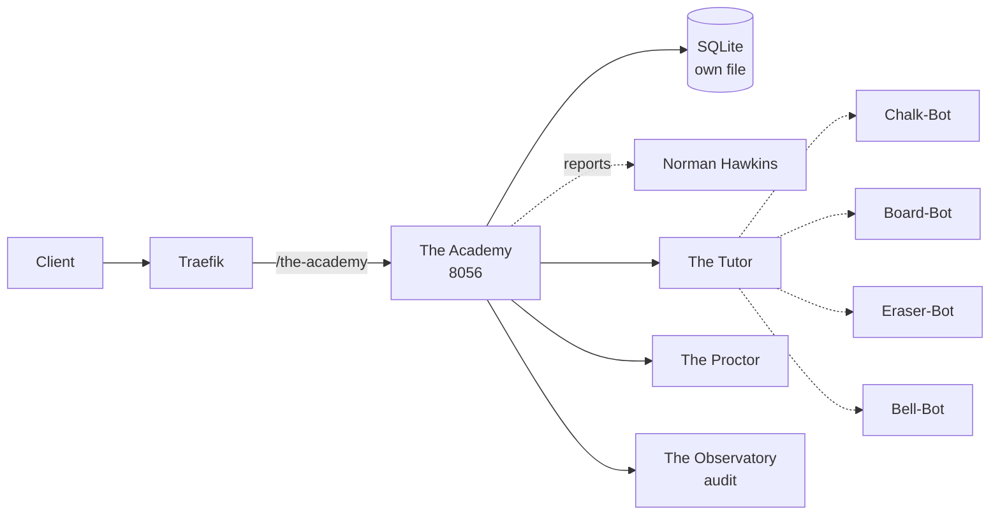

# Solution Pack — The Academy

> **PID-ACA · AID-ACA-01 · Knowledge pillar**  
> Generated by `scripts/build_solution_packs.py`. **DERIVED** sections are read
> from the registers named inline and are verifiable. **SCAFFOLD** sections are
> generated starting points shaped by those facts — drafts to accept or replace,
> not descriptions of what exists.

## 1. What this is — DERIVED

| Field | Value | Source |
|---|---|---|
| Location | The Academy | `src/entities/platform.py` |
| Product ID | `PID-ACA` | `_assign_ids()` |
| Lead AI | Shimshi (`AID-ACA-01`) | `src/entities/platform.py` |
| Base model tier | Tranc3 | `get_orchestration_tier()` |
| Job Description | Head of Learning & Development | `docs/governance/LOCATION-FUNCTIONS.md` |
| Pillar | Knowledge | `Pillar` enum |
| Reports to Prime(s) | Norman Hawkins | `primes` |
| Status | ✅ In repo | `CLAUDE.md` service table |
| Code path | `workers/the-academy/` ✅ on disk | filesystem |
| Port | 8056 | compose / `worker_port` |
| Compose service | `the-academy` | `docker-compose.production.yml` |
| Traefik route | `Host(`the-academy.trancendos.com`) && PathPrefix(`/the-academy`)` | compose labels |
| Rollout priority | P3 | CLAUDE.md worker map |

**Role.** Learning management — education & skill training

## 2. What it does — DERIVED

**Primary function.** Education & Skill Training

**Abilities**
- Adaptive Learning Paths: Alters curriculums based on progress.
- Skill Gap Analysis: Suggests targeted training modules.

**Operating modes**

- *Online:* Live educational modules; cloud-based tutoring.
- *Offline:* Downloaded course materials; offline quiz execution.

The offline mode is a design constraint, not a footnote: it states what this
Location must still deliver when its upstreams are unreachable, and any
implementation that cannot honour it is incomplete regardless of test coverage.

## 3. Architectural requirements — DERIVED constraints, SCAFFOLD targets

**Hard constraints — these come from the estate, not from preference.**

- **Build context is `./workers/the-academy`**, so `src/` is *not* in the image. This Location
  cannot `from src.* import ...` — ported logic must be self-contained. This is the
  single most common cause of a worker that passes tests and dies in the container.
- **SQLite over shared state** — each worker owns its own database file (principle 1).
- **In-memory token-bucket rate limiting** — no external KV (principle 2).
- **Zero-cost posture** — no paid dependency may be introduced without funding sign-off.
- **Traefik `stripprefix` is mandatory** for `/the-academy` routing; without the middleware
  the router matches and the worker 404s on every path. This has bitten the estate
  before (resonate, imind).

**Non-functional targets — SCAFFOLD, set these against real measurements.**

| Attribute | Starting target | Why this number needs replacing |
|---|---|---|
| Health endpoint | `GET /health` < 200 ms | compose healthcheck already polls it |
| p95 latency | < 500 ms | placeholder — no load profile exists yet |
| Availability | 99% single-node | one chassis; see `deploy/CITADEL_OPERATIONS.md` §9 |
| Data durability | volume-backed + off-box backup | snapshots are not backups |

## 4. Design schematic — DERIVED topology



## 5. Blueprint — SCAFFOLD

| Layer | Component | Note |
|---|---|---|
| Ingress | Traefik → the-academy | Host(`the-academy.trancendos.com`) && PathPrefix(`/the-academy`) |
| API | FastAPI app | `/health`, `/status`, domain routes |
| Domain | The Tutor + The Proctor | the two Agents below |
| Automation | Chalk-Bot, Board-Bot, Eraser-Bot, Bell-Bot | the four Bots below |
| Persistence | SQLite | volume not yet declared |
| Observability | structured JSON + W3C trace | `src/observability/tracing.py` |

## 6. Storyboard and schema — SCAFFOLD

A first-run journey, derived from the abilities above. Replace with the real
journey once a user has actually walked it.

```
1. Request arrives  →  Traefik strips /the-academy
2. The Tutor — Modifies materials and guides to match user progress/skill.
3. The Proctor — Evaluates practice coding exercises and logs test scores.
4. Bots fire: Chalk-Bot, Board-Bot, Eraser-Bot, Bell-Bot
5. Result persisted to SQLite; event emitted to The Observatory
6. Response returned with trace_id for correlation
```

**Proposed schema** — shaped by the abilities; not yet implemented.

```sql
CREATE TABLE IF NOT EXISTS the_academy_records (
    id           INTEGER PRIMARY KEY AUTOINCREMENT,
    record_id    TEXT NOT NULL UNIQUE,
    actor        TEXT,
    payload      TEXT NOT NULL,        -- JSON
    state        TEXT NOT NULL DEFAULT 'new',
    created_at   REAL NOT NULL,
    updated_at   REAL
);
CREATE INDEX IF NOT EXISTS idx_the_academy_state ON the_academy_records(state);

CREATE TABLE IF NOT EXISTS the_academy_audit (
    id           INTEGER PRIMARY KEY AUTOINCREMENT,
    record_id    TEXT NOT NULL,
    action       TEXT NOT NULL,
    actor        TEXT,
    at           REAL NOT NULL
);
```

## 7. Components — DERIVED

**Agents (Tier 4)**

| SID | Agent | Responsibility |
|---|---|---|
| `SID-ACA-01` | The Tutor | Modifies materials and guides to match user progress/skill. |
| `SID-ACA-02` | The Proctor | Evaluates practice coding exercises and logs test scores. |

**Bots (Tier 5)**

| NID | Bot | Responsibility |
|---|---|---|
| `NID-ACA-01` | Chalk-Bot | Projects visual charts and interactive terminal sandboxes in the UI. |
| `NID-ACA-02` | Board-Bot | Manages course paths, student lists, and syllabus structures. |
| `NID-ACA-03` | Eraser-Bot | Resets coding sandboxes, removing trial code for the next lesson. |
| `NID-ACA-04` | Bell-Bot | Sends notifications for class dates, live sessions, or deadlines. |

## 8. Design direction — SCAFFOLD

**Foundation.** No OSS foundation is recorded for this Location. Either one
should be chosen and added to CLAUDE.md, or the build-from-scratch decision
should be written down with its reasoning.

**Interface tone.** Knowledge pillar. Surface the two Agents as the
primary verbs and keep the four Bots as background automation the user never
has to name.

## 9. Templates — SCAFFOLD

**Health response** (matches `to_health_meta()`):

```json
{
  "location": "The Academy",
  "pillar": "Knowledge",
  "lead_ai": "Shimshi",
  "primes": ['Norman Hawkins'],
  "status": "ok"
}
```

**Compose service:**

```yaml
  the-academy:
    build: { context: ./workers/the-academy, dockerfile: Dockerfile }
    environment: [ PORT=8056 ]
    ports: [ "8056:8056" ]
    labels:
      - "traefik.http.routers.the-academy.middlewares=strip-the-academy@docker"
      - "traefik.http.middlewares.strip-the-academy.stripprefix.prefixes=/the-academy"
```

## 10. Epics and stories — SCAFFOLD

Sequenced against the readiness gaps below, so the first epic is whatever is
actually missing rather than a generic phase 1.

### Epic 1 — Verify routing end to end

- As a client, requests to `/the-academy` reach the worker with the prefix stripped.
- As a reviewer, a stripprefix middleware exists and is referenced by the router.

### Epic 2 — Implement the abilities

- As a user, I can exercise: Adaptive Learning Paths.
- As a user, I can exercise: Skill Gap Analysis.
- As an auditor, every action emits an Observatory event carrying `PID-ACA`.

### Epic 3 — Prove it works

- As a maintainer, `tests/` covers The Academy's health, status and each ability.
- As a maintainer, the offline mode above is tested, not assumed.

## 11. Technical debt — DERIVED where evidenced

| Item | Evidence | Impact |
|---|---|---|
| No test files under the code path | filesystem check | Regressions land silently |

## 12. Wireframe — SCAFFOLD

```
┌──────────────────────────────────────────────────────┐
│ The Academy                                  PID-ACA │
├──────────────────────────────────────────────────────┤
│ Education & Skill Training                           │
├──────────────────────────────────────────────────────┤
│  ▸ The Tutor                Modifies materials and g│
│  ▸ The Proctor              Evaluates practice codin│
├──────────────────────────────────────────────────────┤
│  bots: Chalk-Bot, Board-Bot, Eraser-Bot, Bell-Bot   │
├──────────────────────────────────────────────────────┤
│  [ health ]  [ status ]  route /the-academy         │
└──────────────────────────────────────────────────────┘
```

## 13. Prioritisation — DERIVED

**Criticality 3/10 · Readiness 8/10 → Defer — below median on both axes**

Classified against the estate's own medians (criticality 3, readiness
8 across all 43 Locations), not a fixed threshold — the two axes do not
share a scale, so one absolute cut-off would bucket almost everything together.

They are also kept separate rather than multiplied. Collapsing them would
double-count: status and dependency facts feed both terms, so the product
systematically ranks safe-and-unimportant above important-and-unfinished.

| Axis | Score | Reasons |
|---|---|---|
| Criticality | 3/10 | worker-map priority P3 (+1); answers to 1 Prime(s) (+1); externally routed via Traefik (+1) |
| Readiness | 8/10 | status ✅ in CLAUDE.md (+3); code path `workers/the-academy/` exists on disk (+2); at least one Python file present (+1); compose service `the-academy` defined (+2) |

## 14. Documentation — DERIVED

- `PLATFORM_ENTITIES.md` — canonical entry for PID-ACA
- `src/entities/platform.py` — `PLATFORM_ENTITIES["The Academy"]`
- `docs/governance/LOCATION-FUNCTIONS.md` — Job Description
- `docs/governance/TRANCENDOS-MODELS-MATRIX.md` — base tier and variants
- `docker-compose.production.yml` — service `the-academy`
- `workers/the-academy/` — implementation
- `compliance/magna-carta/compliance/sector_profiles.yaml` — sector activation

