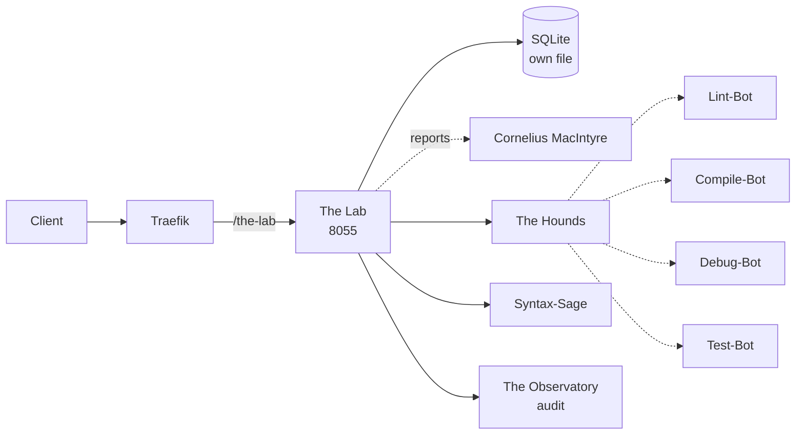

# Solution Pack — The Lab

> **PID-LAB · AID-LAB-01 · Development (Code) pillar**  
> Generated by `scripts/build_solution_packs.py`. **DERIVED** sections are read
> from the registers named inline and are verifiable. **SCAFFOLD** sections are
> generated starting points shaped by those facts — drafts to accept or replace,
> not descriptions of what exists.

## 1. What this is — DERIVED

| Field | Value | Source |
|---|---|---|
| Location | The Lab | `src/entities/platform.py` |
| Product ID | `PID-LAB` | `_assign_ids()` |
| Lead AI | The Dr. (Nikolai O'denhime) (`AID-LAB-01`) | `src/entities/platform.py` |
| All Lead AIs | The Dr. (Nikolai O'denhime), Slime | `lead_ais` |
| Base model tier | T2ance | `get_orchestration_tier()` |
| Job Description | Chief Engineering Officer | `docs/governance/LOCATION-FUNCTIONS.md` |
| Pillar | Development (Code) | `Pillar` enum |
| Reports to Prime(s) | Cornelius MacIntyre | `primes` |
| Status | ✅ Self-hosted | `CLAUDE.md` service table |
| Code path | `workers/the-lab/` ✅ on disk | filesystem |
| Port | 8055 | compose / `worker_port` |
| Compose service | `the-lab` | `docker-compose.production.yml` |
| Traefik route | `Host(`the-lab.trancendos.com`) && PathPrefix(`/the-lab`)` | compose labels |
| Rollout priority | P3 | CLAUDE.md worker map |
| OSS foundation | `continuedev/continue` (24K★, Apache 2.0) | CLAUDE.md |

**Role.** Code creation platform (Claude Code-style)

## 2. What it does — DERIVED

**Primary function.** Code Creation Platform

**Abilities**
- Generative Syntax Matrix: Real-time pair programming.
- Instant Sandbox Compiling: Executes isolated code.

**Operating modes**

- *Online:* Live AI coding; sandbox compilation; pair programming.
- *Offline:* Local IDE environment; offline code drafting/linting.

The offline mode is a design constraint, not a footnote: it states what this
Location must still deliver when its upstreams are unreachable, and any
implementation that cannot honour it is incomplete regardless of test coverage.

## 3. Architectural requirements — DERIVED constraints, SCAFFOLD targets

**Hard constraints — these come from the estate, not from preference.**

- **Build context is `./workers/the-lab`**, so `src/` is *not* in the image. This Location
  cannot `from src.* import ...` — ported logic must be self-contained. This is the
  single most common cause of a worker that passes tests and dies in the container.
- **SQLite over shared state** — each worker owns its own database file (principle 1).
- **In-memory token-bucket rate limiting** — no external KV (principle 2).
- **Zero-cost posture** — no paid dependency may be introduced without funding sign-off.
- **Traefik `stripprefix` is mandatory** for `/the-lab` routing; without the middleware
  the router matches and the worker 404s on every path. This has bitten the estate
  before (resonate, imind).

**Non-functional targets — SCAFFOLD, set these against real measurements.**

| Attribute | Starting target | Why this number needs replacing |
|---|---|---|
| Health endpoint | `GET /health` < 200 ms | compose healthcheck already polls it |
| p95 latency | < 500 ms | placeholder — no load profile exists yet |
| Availability | 99% single-node | one chassis; see `deploy/CITADEL_OPERATIONS.md` §9 |
| Data durability | volume-backed + off-box backup | snapshots are not backups |

## 4. Design schematic — DERIVED topology



## 5. Blueprint — SCAFFOLD

| Layer | Component | Note |
|---|---|---|
| Ingress | Traefik → the-lab | Host(`the-lab.trancendos.com`) && PathPrefix(`/the-lab`) |
| API | FastAPI app | `/health`, `/status`, domain routes |
| Domain | The Hounds + Syntax-Sage | the two Agents below |
| Automation | Lint-Bot, Compile-Bot, Debug-Bot, Test-Bot | the four Bots below |
| Persistence | SQLite | volume not yet declared |
| Observability | structured JSON + W3C trace | `src/observability/tracing.py` |

## 6. Storyboard and schema — SCAFFOLD

A first-run journey, derived from the abilities above. Replace with the real
journey once a user has actually walked it.

```
1. Request arrives  →  Traefik strips /the-lab
2. The Hounds — Searches sandbox code for syntax errors and memory leaks.
3. Syntax-Sage — Reads active scripts, suggesting code optimization patterns.
4. Bots fire: Lint-Bot, Compile-Bot, Debug-Bot, Test-Bot
5. Result persisted to SQLite; event emitted to The Observatory
6. Response returned with trace_id for correlation
```

**Proposed schema** — shaped by the abilities; not yet implemented.

```sql
CREATE TABLE IF NOT EXISTS the_lab_records (
    id           INTEGER PRIMARY KEY AUTOINCREMENT,
    record_id    TEXT NOT NULL UNIQUE,
    actor        TEXT,
    payload      TEXT NOT NULL,        -- JSON
    state        TEXT NOT NULL DEFAULT 'new',
    created_at   REAL NOT NULL,
    updated_at   REAL
);
CREATE INDEX IF NOT EXISTS idx_the_lab_state ON the_lab_records(state);

CREATE TABLE IF NOT EXISTS the_lab_audit (
    id           INTEGER PRIMARY KEY AUTOINCREMENT,
    record_id    TEXT NOT NULL,
    action       TEXT NOT NULL,
    actor        TEXT,
    at           REAL NOT NULL
);
```

## 7. Components — DERIVED

**Agents (Tier 4)**

| SID | Agent | Responsibility |
|---|---|---|
| `SID-LAB-01` | The Hounds | Searches sandbox code for syntax errors and memory leaks. |
| `SID-LAB-02` | Syntax-Sage | Reads active scripts, suggesting code optimization patterns. |

**Bots (Tier 5)**

| NID | Bot | Responsibility |
|---|---|---|
| `NID-LAB-01` | Lint-Bot | Formats and styles code to match company guidelines. |
| `NID-LAB-02` | Compile-Bot | Runs rapid, isolated builds to verify code compilation. |
| `NID-LAB-03` | Debug-Bot | Inspects runtime stacks, pinpointing errors to the exact line. |
| `NID-LAB-04` | Test-Bot | Runs automated code tests, reporting pass/fail ratios. |

**Per-Lead-AI agent teams** — this Location runs a dedicated pair per named AI.

| Lead AI | Alpha | Beta |
|---|---|---|
| The Dr. (Nikolai O'denhime) | The Hounds | Syntax-Sage |
| Slime | The Root-Causer | The Patch-Weaver |

## 8. Design direction — SCAFFOLD

**Foundation.** `continuedev/continue` (24K★, Apache 2.0) is the vetted
starting point recorded in CLAUDE.md. Check the licence against the zero-cost
posture before adopting — self-host-free is not the same as permissive.

**Interface tone.** Development (Code) pillar. Surface the two Agents as the
primary verbs and keep the four Bots as background automation the user never
has to name.

## 9. Templates — SCAFFOLD

**Health response** (matches `to_health_meta()`):

```json
{
  "location": "The Lab",
  "pillar": "Development (Code)",
  "lead_ai": "The Dr. (Nikolai O'denhime)",
  "primes": ['Cornelius MacIntyre'],
  "status": "ok"
}
```

**Compose service:**

```yaml
  the-lab:
    build: { context: ./workers/the-lab, dockerfile: Dockerfile }
    environment: [ PORT=8055 ]
    ports: [ "8055:8055" ]
    labels:
      - "traefik.http.routers.the-lab.middlewares=strip-the-lab@docker"
      - "traefik.http.middlewares.strip-the-lab.stripprefix.prefixes=/the-lab"
```

## 10. Epics and stories — SCAFFOLD

Sequenced against the readiness gaps below, so the first epic is whatever is
actually missing rather than a generic phase 1.

### Epic 1 — Verify routing end to end

- As a client, requests to `/the-lab` reach the worker with the prefix stripped.
- As a reviewer, a stripprefix middleware exists and is referenced by the router.

### Epic 2 — Implement the abilities

- As a user, I can exercise: Generative Syntax Matrix.
- As a user, I can exercise: Instant Sandbox Compiling.
- As an auditor, every action emits an Observatory event carrying `PID-LAB`.

### Epic 3 — Prove it works

- As a maintainer, `tests/` covers The Lab's health, status and each ability.
- As a maintainer, the offline mode above is tested, not assumed.

## 11. Technical debt — DERIVED where evidenced

| Item | Evidence | Impact |
|---|---|---|
| Two candidate implementations: registered `workers/the-lab/` vs `workers/lab-service/` | both directories exist on disk | Registry and CLAUDE.md name different workers for this Location — port, route and readiness above follow the registered one |
| No test files under the code path | filesystem check | Regressions land silently |

## 12. Wireframe — SCAFFOLD

```
┌──────────────────────────────────────────────────────┐
│ The Lab                                      PID-LAB │
├──────────────────────────────────────────────────────┤
│ Code Creation Platform                               │
├──────────────────────────────────────────────────────┤
│  ▸ The Hounds               Searches sandbox code fo│
│  ▸ Syntax-Sage              Reads active scripts, su│
├──────────────────────────────────────────────────────┤
│  bots: Lint-Bot, Compile-Bot, Debug-Bot, Test-Bot   │
├──────────────────────────────────────────────────────┤
│  [ health ]  [ status ]  route /the-lab             │
└──────────────────────────────────────────────────────┘
```

## 13. Prioritisation — DERIVED

**Criticality 7/10 · Readiness 8/10 → Invest — above-median dependency, below-median readiness**

Classified against the estate's own medians (criticality 3, readiness
8 across all 43 Locations), not a fixed threshold — the two axes do not
share a scale, so one absolute cut-off would bucket almost everything together.

They are also kept separate rather than multiplied. Collapsing them would
double-count: status and dependency facts feed both terms, so the product
systematically ranks safe-and-unimportant above important-and-unfinished.

**3 other Location(s) name this one's AI as their Prime.** An outage
here is not local.

| Axis | Score | Reasons |
|---|---|---|
| Criticality | 7/10 | worker-map priority P3 (+1); 3 Location(s) name this one's AI as their Prime (+3); answers to 1 Prime(s) (+1); 2 Lead AIs — multi-team Location (+1); externally routed via Traefik (+1) |
| Readiness | 8/10 | status ✅ in CLAUDE.md (+3); code path `workers/the-lab/` exists on disk (+2); at least one Python file present (+1); compose service `the-lab` defined (+2) |

## 14. Documentation — DERIVED

- `PLATFORM_ENTITIES.md` — canonical entry for PID-LAB
- `src/entities/platform.py` — `PLATFORM_ENTITIES["The Lab"]`
- `docs/governance/LOCATION-FUNCTIONS.md` — Job Description
- `docs/governance/TRANCENDOS-MODELS-MATRIX.md` — base tier and variants
- `docker-compose.production.yml` — service `the-lab`
- `workers/the-lab/` — implementation
- `compliance/magna-carta/compliance/sector_profiles.yaml` — sector activation

