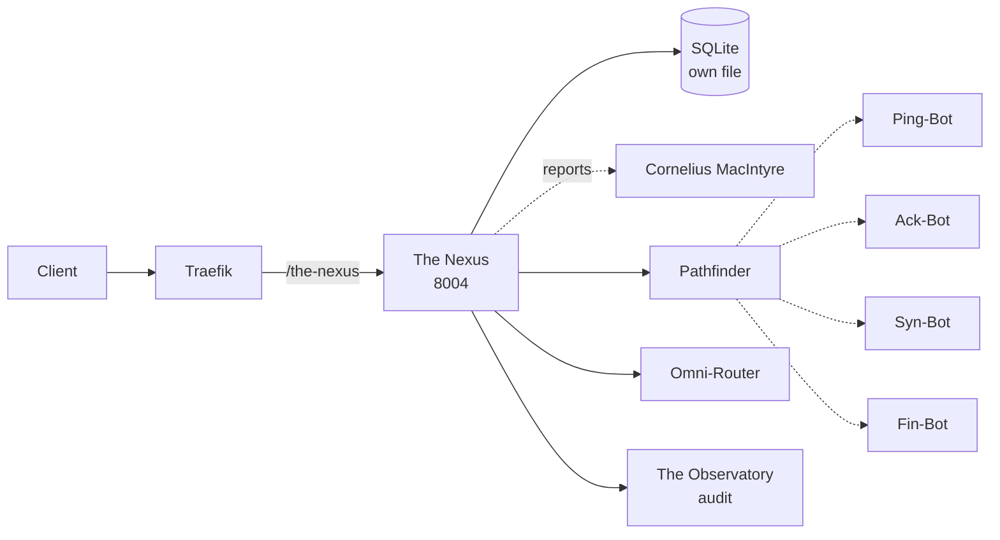

# Solution Pack — The Nexus

> **PID-NXS · AID-NXS-01 · Architectural pillar**
>
> Generated by `scripts/build_solution_packs.py`. **DERIVED** sections are read
> from the registers named inline and are verifiable. **SCAFFOLD** sections are
> generated starting points shaped by those facts — drafts to accept or replace,
> not descriptions of what exists.

## 1. What this is — DERIVED

| Field | Value | Source |
|---|---|---|
| Location | The Nexus | `src/entities/platform.py` |
| Product ID | `PID-NXS` | `_assign_ids()` |
| Lead AI | Nexus-Prime (`AID-NXS-01`) | `src/entities/platform.py` |
| Base model tier | Tranc3 | `get_orchestration_tier()` |
| Job Description | Chief Communications Officer | `docs/governance/LOCATION-FUNCTIONS.md` |
| Pillar | Architectural | `Pillar` enum |
| Reports to Prime(s) | Cornelius MacIntyre | `primes` |
| Status | 🔧 Self-hosted | `CLAUDE.md` service table |
| Code path | `workers/infinity-ws/` ✅ on disk | filesystem |
| Port | 8004 | compose / `worker_port` |
| Compose service | `infinity-ws` | `docker-compose.production.yml` |
| Traefik route | `Host(`api.trancendos.com`) && PathPrefix(`/ws`)` | compose labels |
| Rollout priority | P0 | CLAUDE.md worker map |

**Role.** AI communications and transfer hub

## 2. What it does — DERIVED

**Primary function.** AI Communication Gateway & AI, Agent, and Bot / Worker Transfer Hub

**Abilities**
- Omni-Channel Routing: Parses and directs intent.
- Worker Migration: Transfers entities between hubs.

**Operating modes**

- *Online:* Real-time chat interface; active entity transfer.
- *Offline:* Cached chat logs; delayed routing (queued).

The offline mode is a design constraint, not a footnote: it states what this
Location must still deliver when its upstreams are unreachable, and any
implementation that cannot honour it is incomplete regardless of test coverage.

## 3. Architectural requirements — DERIVED constraints, SCAFFOLD targets

**Hard constraints — these come from the estate, not from preference.**

- **Build context is `.`** (the repo root), so `src/` *is* in the image and
  this worker's Dockerfile may COPY from it. Narrowing the context to the worker
  directory would break the build — check the Dockerfile before changing it.
- **SQLite over shared state** — each worker owns its own database file (principle 1).
- **In-memory token-bucket rate limiting** — no external KV (principle 2).
- **Zero-cost posture** — no paid dependency may be introduced without funding sign-off.
- **No `stripprefix` on `/ws`** — and that is deliberate: this
  worker serves the prefixed paths itself, so stripping would route `/ws/x`
  to `/x`, which it does not serve. Adding the middleware would break it.

**Non-functional targets — SCAFFOLD, set these against real measurements.**

| Attribute | Starting target | Why this number needs replacing |
|---|---|---|
| Health endpoint | `GET /health` < 200 ms | compose healthcheck already polls it |
| p95 latency | < 500 ms | placeholder — no load profile exists yet |
| Availability | 99% single-node | one chassis; see `deploy/CITADEL_OPERATIONS.md` §9 |
| Data durability | volume-backed + off-box backup | snapshots are not backups |

## 4. Design schematic — DERIVED topology



## 5. Blueprint — SCAFFOLD

| Layer | Component | Note |
|---|---|---|
| Ingress | Traefik → the-nexus | Host(`api.trancendos.com`) && PathPrefix(`/ws`) |
| API | FastAPI app | `/health`, `/status`, domain routes |
| Domain | Pathfinder + Omni-Router | the two Agents below |
| Automation | Ping-Bot, Ack-Bot, Syn-Bot, Fin-Bot | the four Bots below |
| Persistence | SQLite | volume not yet declared |
| Observability | structured JSON + W3C trace | `src/observability/tracing.py` |

## 6. Storyboard and schema — SCAFFOLD

A first-run journey, derived from the abilities above. Replace with the real
journey once a user has actually walked it.

```
1. Request arrives  →  Traefik strips /ws
2. Pathfinder — Maps fast system data communication routes.
3. Omni-Router — Routes user prompts to the correct AI/Bot.
4. Bots fire: Ping-Bot, Ack-Bot, Syn-Bot, Fin-Bot
5. Result persisted to SQLite; event emitted to The Observatory
6. Response returned with trace_id for correlation
```

**Proposed schema** — shaped by the abilities; not yet implemented.

```sql
CREATE TABLE IF NOT EXISTS the_nexus_records (
    id           INTEGER PRIMARY KEY AUTOINCREMENT,
    record_id    TEXT NOT NULL UNIQUE,
    actor        TEXT,
    payload      TEXT NOT NULL,        -- JSON
    state        TEXT NOT NULL DEFAULT 'new',
    created_at   REAL NOT NULL,
    updated_at   REAL
);
CREATE INDEX IF NOT EXISTS idx_the_nexus_state ON the_nexus_records(state);

CREATE TABLE IF NOT EXISTS the_nexus_audit (
    id           INTEGER PRIMARY KEY AUTOINCREMENT,
    record_id    TEXT NOT NULL,
    action       TEXT NOT NULL,
    actor        TEXT,
    at           REAL NOT NULL
);
```

## 7. Components — DERIVED

**Agents (Tier 4)**

| SID | Agent | Responsibility |
|---|---|---|
| `SID-NXS-01` | Pathfinder | Maps fast system data communication routes. |
| `SID-NXS-02` | Omni-Router | Routes user prompts to the correct AI/Bot. |

**Bots (Tier 5)**

| NID | Bot | Responsibility |
|---|---|---|
| `NID-NXS-01` | Ping-Bot | Measures connection network latency. |
| `NID-NXS-02` | Ack-Bot | Confirms data transitions and logs stamps. |
| `NID-NXS-03` | Syn-Bot | Harmonizes offline caches with cloud data. |
| `NID-NXS-04` | Fin-Bot | Closes data channels and flushes memory. |

## 8. Design direction — SCAFFOLD

**Foundation.** No OSS foundation is recorded for this Location. Either one
should be chosen and added to CLAUDE.md, or the build-from-scratch decision
should be written down with its reasoning.

**Interface tone.** Architectural pillar. Surface the two Agents as the
primary verbs and keep the four Bots as background automation the user never
has to name.

## 9. Templates — SCAFFOLD

**Health response** (matches `to_health_meta()`):

```json
{
  "location": "The Nexus",
  "pillar": "Architectural",
  "lead_ai": "Nexus-Prime",
  "primes": ['Cornelius MacIntyre'],
  "status": "ok"
}
```

**Compose service:**

```yaml
  infinity-ws:
    build: { context: ., dockerfile: workers/infinity-ws/Dockerfile }
    environment: [ PORT=8004 ]
    ports: [ "8004:8004" ]
    labels:
      - "traefik.http.routers.infinity-ws.rule=Host(`api.trancendos.com`) && PathPrefix(`/ws`)"
```

## 10. Epics and stories — SCAFFOLD

Sequenced against the readiness gaps below, so the first epic is whatever is
actually missing rather than a generic phase 1.

### Epic 1 — Verify routing end to end

- As a client, requests to `/ws` reach the worker with the prefix stripped.
- As a reviewer, a stripprefix middleware exists and is referenced by the router.

### Epic 2 — Implement the abilities

- As a user, I can exercise: Omni-Channel Routing.
- As a user, I can exercise: Worker Migration.
- As an auditor, every action emits an Observatory event carrying `PID-NXS`.

### Epic 3 — Prove it works

- As a maintainer, `tests/` covers The Nexus's health, status and each ability.
- As a maintainer, the offline mode above is tested, not assumed.

## 11. Technical debt — DERIVED where evidenced

| Item | Evidence | Impact |
|---|---|---|
| No test files under the code path | filesystem check | Regressions land silently |
| Status is 🔧 Self-hosted | CLAUDE.md service table | Partial — not production-complete |

## 12. Wireframe — SCAFFOLD

```
┌──────────────────────────────────────────────────────┐
│ The Nexus                                    PID-NXS │
├──────────────────────────────────────────────────────┤
│ AI Communication Gateway & AI, Agent, and Bot / Work │
├──────────────────────────────────────────────────────┤
│  ▸ Pathfinder               Maps fast system data co│
│  ▸ Omni-Router              Routes user prompts to t│
├──────────────────────────────────────────────────────┤
│  bots: Ping-Bot, Ack-Bot, Syn-Bot, Fin-Bot          │
├──────────────────────────────────────────────────────┤
│  [ health ]  [ status ]  route /the-nexus           │
└──────────────────────────────────────────────────────┘
```

## 13. Prioritisation — DERIVED

**Criticality 9/10 · Readiness 6/10 → Invest — above-median dependency, below-median readiness**

Classified against the estate's own medians (criticality 3, readiness
8 across all 43 Locations), not a fixed threshold — the two axes do not
share a scale, so one absolute cut-off would bucket almost everything together.

They are also kept separate rather than multiplied. Collapsing them would
double-count: status and dependency facts feed both terms, so the product
systematically ranks safe-and-unimportant above important-and-unfinished.

| Axis | Score | Reasons |
|---|---|---|
| Criticality | 9/10 | worker-map priority P0 (+5); answers to 1 Prime(s) (+1); Architectural pillar — platform-wide blast radius (+2); externally routed via Traefik (+1) |
| Readiness | 6/10 | status 🔧 partial/migrating (+1); code path `workers/infinity-ws/` exists on disk (+2); at least one Python file present (+1); compose service `infinity-ws` defined (+2) |

## 14. Documentation — DERIVED

- `PLATFORM_ENTITIES.md` — canonical entry for PID-NXS
- `src/entities/platform.py` — `PLATFORM_ENTITIES["The Nexus"]`
- `docs/governance/LOCATION-FUNCTIONS.md` — Job Description
- `docs/governance/TRANCENDOS-MODELS-MATRIX.md` — base tier and variants
- `docker-compose.production.yml` — service `infinity-ws`
- `workers/infinity-ws/` — implementation
- `compliance/magna-carta/compliance/sector_profiles.yaml` — sector activation
