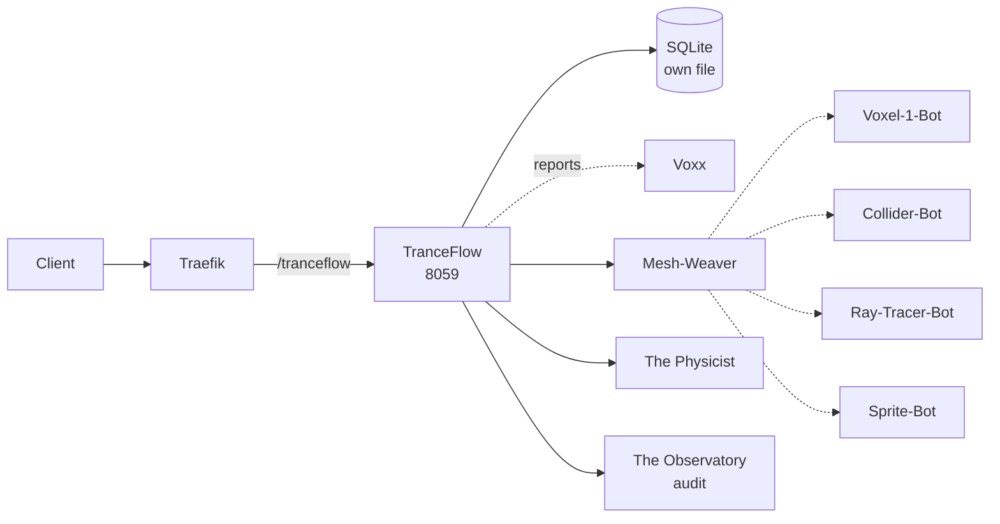

# Solution Pack — TranceFlow

> **PID-TFL · AID-TFL-01 · Creativity pillar**
>
> Generated by `scripts/build_solution_packs.py`. **DERIVED** sections are read
> from the registers named inline and are verifiable. **SCAFFOLD** sections are
> generated starting points shaped by those facts — drafts to accept or replace,
> not descriptions of what exists.

## 1. What this is — DERIVED

| Field | Value | Source |
|---|---|---|
| Location | TranceFlow | `src/entities/platform.py` |
| Product ID | `PID-TFL` | `_assign_ids()` |
| Lead AI | Junior Cesar (`AID-TFL-01`) | `src/entities/platform.py` |
| Base model tier | Tranc3 | `get_orchestration_tier()` |
| Job Description | Head of 3D & Game Development | `docs/governance/LOCATION-FUNCTIONS.md` |
| Pillar | Creativity | `Pillar` enum |
| Reports to Prime(s) | Voxx | `primes` |
| Status | ✅ In repo | `CLAUDE.md` service table |
| Code path | `workers/tranceflow/` ✅ on disk | filesystem |
| Port | 8059 | compose / `worker_port` |
| Compose service | `tranceflow` | `docker-compose.production.yml` |
| Traefik route | `Host(`tranceflow.trancendos.com`) && PathPrefix(`/tranceflow`)` | compose labels |
| Rollout priority | P3 | CLAUDE.md worker map |
| OSS foundation | `godotengine/godot` (94K★, MIT) | CLAUDE.md |

**Role.** 3D modeling & games creation studio

## 2. What it does — DERIVED

**Primary function.** 3D Modeling & Games Creation Studio

**Abilities**
- Browser-Native Engine: Runs game logic/physics.
- Real-time Sculpting: Shapes/textures 3D spaces.

**Operating modes**

- *Online:* Live collaborative game dev; cloud rendering.
- *Offline:* Local 3D model editing; offline game logic drafting.

The offline mode is a design constraint, not a footnote: it states what this
Location must still deliver when its upstreams are unreachable, and any
implementation that cannot honour it is incomplete regardless of test coverage.

## 3. Architectural requirements — DERIVED constraints, SCAFFOLD targets

**Hard constraints — these come from the estate, not from preference.**

- **Build context is `./workers/tranceflow`**, so `src/` is *not* in the image. This Location
  cannot `from src.* import ...` — ported logic must be self-contained. This is the
  single most common cause of a worker that passes tests and dies in the container.
- **SQLite over shared state** — each worker owns its own database file (principle 1).
- **In-memory token-bucket rate limiting** — no external KV (principle 2).
- **Zero-cost posture** — no paid dependency may be introduced without funding sign-off.
- **No `stripprefix` on `/tranceflow`** — and that is deliberate: this
  worker serves the prefixed paths itself, so stripping would route `/tranceflow/x`
  to `/x`, which it does not serve. Adding the middleware would break it.

**Non-functional targets — SCAFFOLD, set these against real measurements.**

| Attribute | Starting target | Why this number needs replacing |
|---|---|---|
| Health endpoint | `GET /health` < 200 ms | compose healthcheck already polls it |
| p95 latency | < 500 ms | placeholder — no load profile exists yet |
| Availability | 99% single-node | one chassis; see `deploy/CITADEL_OPERATIONS.md` §9 |
| Data durability | volume-backed + off-box backup | snapshots are not backups |

## 4. Design schematic — DERIVED topology



## 5. Blueprint — SCAFFOLD

| Layer | Component | Note |
|---|---|---|
| Ingress | Traefik → tranceflow | Host(`tranceflow.trancendos.com`) && PathPrefix(`/tranceflow`) |
| API | FastAPI app | `/health`, `/status`, domain routes |
| Domain | Mesh-Weaver + The Physicist | the two Agents below |
| Automation | Voxel-1-Bot, Collider-Bot, Ray-Tracer-Bot, Sprite-Bot | the four Bots below |
| Persistence | SQLite | tranceflow-data → /data |
| Observability | structured JSON + W3C trace | `src/observability/tracing.py` |

## 6. Storyboard and schema — SCAFFOLD

A first-run journey, derived from the abilities above. Replace with the real
journey once a user has actually walked it.

```
1. Request arrives  →  Traefik strips /tranceflow
2. Mesh-Weaver — Synthesizes wireframes and converts data to meshes.
3. The Physicist — Calculates rigid body dynamics and object collision.
4. Bots fire: Voxel-1-Bot, Collider-Bot, Ray-Tracer-Bot, Sprite-Bot
5. Result persisted to SQLite; event emitted to The Observatory
6. Response returned with trace_id for correlation
```

**Proposed schema** — shaped by the abilities; not yet implemented.

```sql
CREATE TABLE IF NOT EXISTS tranceflow_records (
    id           INTEGER PRIMARY KEY AUTOINCREMENT,
    record_id    TEXT NOT NULL UNIQUE,
    actor        TEXT,
    payload      TEXT NOT NULL,        -- JSON
    state        TEXT NOT NULL DEFAULT 'new',
    created_at   REAL NOT NULL,
    updated_at   REAL
);
CREATE INDEX IF NOT EXISTS idx_tranceflow_state ON tranceflow_records(state);

CREATE TABLE IF NOT EXISTS tranceflow_audit (
    id           INTEGER PRIMARY KEY AUTOINCREMENT,
    record_id    TEXT NOT NULL,
    action       TEXT NOT NULL,
    actor        TEXT,
    at           REAL NOT NULL
);
```

## 7. Components — DERIVED

**Agents (Tier 4)**

| SID | Agent | Responsibility |
|---|---|---|
| `SID-TFL-01` | Mesh-Weaver | Synthesizes wireframes and converts data to meshes. |
| `SID-TFL-02` | The Physicist | Calculates rigid body dynamics and object collision. |

**Bots (Tier 5)**

| NID | Bot | Responsibility |
|---|---|---|
| `NID-TFL-01` | Voxel-1-Bot | Generates grid-based blocks and terrain geometries. |
| `NID-TFL-02` | Collider-Bot | Monitors boundary boxes for collision scripts. |
| `NID-TFL-03` | Ray-Tracer-Bot | Handles lighting paths, reflections, and shadows. |
| `NID-TFL-04` | Sprite-Bot | Renders fast 2D graphics and UIs over 3D spaces. |

## 8. Design direction — SCAFFOLD

**Foundation.** `godotengine/godot` (94K★, MIT) is the vetted
starting point recorded in CLAUDE.md. Check the licence against the zero-cost
posture before adopting — self-host-free is not the same as permissive.

**Interface tone.** Creativity pillar. Surface the two Agents as the
primary verbs and keep the four Bots as background automation the user never
has to name.

## 9. Templates — SCAFFOLD

**Health response** (matches `to_health_meta()`):

```json
{
  "location": "TranceFlow",
  "pillar": "Creativity",
  "lead_ai": "Junior Cesar",
  "primes": ['Voxx'],
  "status": "ok"
}
```

**Compose service:**

```yaml
  tranceflow:
    build: { context: ./workers/tranceflow, dockerfile: Dockerfile }
    environment: [ PORT=8059 ]
    ports: [ "8059:8059" ]
    labels:
      - "traefik.http.routers.tranceflow.rule=Host(`tranceflow.trancendos.com`) && PathPrefix(`/tranceflow`)"
```

## 10. Epics and stories — SCAFFOLD

Sequenced against the readiness gaps below, so the first epic is whatever is
actually missing rather than a generic phase 1.

### Epic 1 — Verify routing end to end

- As a client, requests to `/tranceflow` reach the worker with the prefix stripped.
- As a reviewer, a stripprefix middleware exists and is referenced by the router.

### Epic 2 — Implement the abilities

- As a user, I can exercise: Browser-Native Engine.
- As a user, I can exercise: Real-time Sculpting.
- As an auditor, every action emits an Observatory event carrying `PID-TFL`.

### Epic 3 — Prove it works

- As a maintainer, `tests/` covers TranceFlow's health, status and each ability.
- As a maintainer, the offline mode above is tested, not assumed.

## 11. Technical debt — DERIVED where evidenced

| Item | Evidence | Impact |
|---|---|---|
| No test files under the code path | filesystem check | Regressions land silently |

## 12. Wireframe — SCAFFOLD

```
┌──────────────────────────────────────────────────────┐
│ TranceFlow                                   PID-TFL │
├──────────────────────────────────────────────────────┤
│ 3D Modeling & Games Creation Studio                  │
├──────────────────────────────────────────────────────┤
│  ▸ Mesh-Weaver              Synthesizes wireframes a│
│  ▸ The Physicist            Calculates rigid body dy│
├──────────────────────────────────────────────────────┤
│  bots: Voxel-1-Bot, Collider-Bot, Ray-Tracer-Bot, S │
├──────────────────────────────────────────────────────┤
│  [ health ]  [ status ]  route /tranceflow          │
└──────────────────────────────────────────────────────┘
```

## 13. Prioritisation — DERIVED

**Criticality 3/10 · Readiness 9/10 → Harvest — built out, below-median dependency; polish and ship**

Classified against the estate's own medians (criticality 3, readiness
8 across all 43 Locations), not a fixed threshold — the two axes do not
share a scale, so one absolute cut-off would bucket almost everything together.

They are also kept separate rather than multiplied. Collapsing them would
double-count: status and dependency facts feed both terms, so the product
systematically ranks safe-and-unimportant above important-and-unfinished.

| Axis | Score | Reasons |
|---|---|---|
| Criticality | 3/10 | worker-map priority P3 (+1); answers to 1 Prime(s) (+1); externally routed via Traefik (+1) |
| Readiness | 9/10 | status ✅ in CLAUDE.md (+3); code path `workers/tranceflow/` exists on disk (+2); three or more Python files present (+2); compose service `tranceflow` defined (+2) |

## 14. Documentation — DERIVED

- `PLATFORM_ENTITIES.md` — canonical entry for PID-TFL
- `src/entities/platform.py` — `PLATFORM_ENTITIES["TranceFlow"]`
- `docs/governance/LOCATION-FUNCTIONS.md` — Job Description
- `docs/governance/TRANCENDOS-MODELS-MATRIX.md` — base tier and variants
- `docker-compose.production.yml` — service `tranceflow`
- `workers/tranceflow/` — implementation
- `compliance/magna-carta/compliance/sector_profiles.yaml` — sector activation
