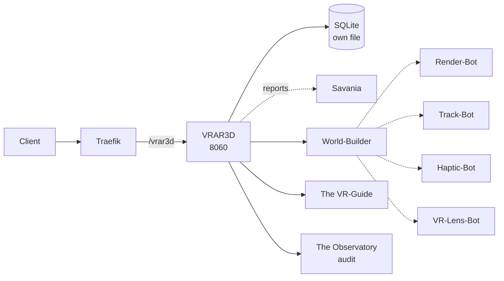

# Solution Pack — VRAR3D

> **PID-VR3 · AID-VR3-01 · Wellbeing pillar**
>
> Generated by `scripts/build_solution_packs.py`. **DERIVED** sections are read
> from the registers named inline and are verifiable. **SCAFFOLD** sections are
> generated starting points shaped by those facts — drafts to accept or replace,
> not descriptions of what exists.

## 1. What this is — DERIVED

| Field | Value | Source |
|---|---|---|
| Location | VRAR3D | `src/entities/platform.py` |
| Product ID | `PID-VR3` | `_assign_ids()` |
| Lead AI | Entari (`AID-VR3-01`) | `src/entities/platform.py` |
| Base model tier | Tranc3 | `get_orchestration_tier()` |
| Job Description | Head of Immersive Technology | `docs/governance/LOCATION-FUNCTIONS.md` |
| Pillar | Wellbeing | `Pillar` enum |
| Reports to Prime(s) | Savania | `primes` |
| Status | ✅ Self-hosted | `CLAUDE.md` service table |
| Code path | `workers/vrar3d/` ✅ on disk | filesystem |
| Port | 8060 | compose / `worker_port` |
| Compose service | `vrar3d` | `docker-compose.production.yml` |
| Traefik route | ``Host(`vrar3d.trancendos.com`) && PathPrefix(`/vrar3d`)`` | compose labels |
| Rollout priority | P3 | CLAUDE.md worker map |
| OSS foundation | `mrdoob/three.js` (103K★, MIT) | CLAUDE.md |

**Role.** Standalone 3D / VR immersion

## 2. What it does — DERIVED

**Primary function.** Standalone 3D / VR immersion

**Abilities**
- Somatic Feedback Loops: Translates exercises to VR haptics.
- Spatial Therapy Environments: Infinite 3D calming landscapes.

**Operating modes**

- *Online:* Live 3D/VR environment rendering; spatial therapy sessions.
- *Offline:* Pre-downloaded 3D environments; localized VR meditation.

The offline mode is a design constraint, not a footnote: it states what this
Location must still deliver when its upstreams are unreachable, and any
implementation that cannot honour it is incomplete regardless of test coverage.

## 3. Architectural requirements — DERIVED constraints, SCAFFOLD targets

**Hard constraints — these come from the estate, not from preference.**

- **Build context is `./workers/vrar3d`**, so `src/` is *not* in the image. This Location
  cannot `from src.* import ...` — ported logic must be self-contained. This is the
  single most common cause of a worker that passes tests and dies in the container.
- **SQLite over shared state** — each worker owns its own database file (principle 1).
- **In-memory token-bucket rate limiting** — no external KV (principle 2).
- **Zero-cost posture** — no paid dependency may be introduced without funding sign-off.
- **No `stripprefix` on `/vrar3d`, and none is needed** — verified,
  because this worker's own source registers paths under it, so the prefix must reach
  it intact. Adding the middleware would break it.

**Non-functional targets — SCAFFOLD, set these against real measurements.**

| Attribute | Starting target | Why this number needs replacing |
|---|---|---|
| Health endpoint | `GET /health` < 200 ms | compose healthcheck already polls it |
| p95 latency | < 500 ms | placeholder — no load profile exists yet |
| Availability | 99% single-node | one chassis; see `deploy/CITADEL_OPERATIONS.md` §9 |
| Data durability | volume-backed + off-box backup | snapshots are not backups |

## 4. Design schematic — DERIVED topology



## 5. Blueprint — SCAFFOLD

| Layer | Component | Note |
|---|---|---|
| Ingress | Traefik → /vrar3d | ``Host(`vrar3d.trancendos.com`) && PathPrefix(`/vrar3d`)`` |
| API | FastAPI app | `/health`, `/status`, domain routes |
| Domain | World-Builder + The VR-Guide | the two Agents below |
| Automation | Render-Bot, Track-Bot, Haptic-Bot, VR-Lens-Bot | the four Bots below |
| Persistence | SQLite | vrar3d-data → /data |
| Observability | structured JSON + W3C trace | `src/observability/tracing.py` |

## 6. Storyboard and schema — SCAFFOLD

A first-run journey, derived from the abilities above. Replace with the real
journey once a user has actually walked it.

```
1. Request arrives  →  Traefik forwards /vrar3d unchanged (no stripprefix)
2. World-Builder — Renders calming, expansive three-dimensional therapeutic environments.
3. The VR-Guide — Leads users through structured spatial tasks within virtual relaxation areas.
4. Bots fire: Render-Bot, Track-Bot, Haptic-Bot, VR-Lens-Bot
5. Result persisted to SQLite; event emitted to The Observatory
6. Response returned with trace_id for correlation
```

**Proposed schema** — shaped by the abilities; not yet implemented.

```sql
CREATE TABLE IF NOT EXISTS vrar3d_records (
    id           INTEGER PRIMARY KEY AUTOINCREMENT,
    record_id    TEXT NOT NULL UNIQUE,
    actor        TEXT,
    payload      TEXT NOT NULL,        -- JSON
    state        TEXT NOT NULL DEFAULT 'new',
    created_at   REAL NOT NULL,
    updated_at   REAL
);
CREATE INDEX IF NOT EXISTS idx_vrar3d_state ON vrar3d_records(state);

CREATE TABLE IF NOT EXISTS vrar3d_audit (
    id           INTEGER PRIMARY KEY AUTOINCREMENT,
    record_id    TEXT NOT NULL,
    action       TEXT NOT NULL,
    actor        TEXT,
    at           REAL NOT NULL
);
```

## 7. Components — DERIVED

**Agents (Tier 4)**

| SID | Agent | Responsibility |
|---|---|---|
| `SID-VR3-01` | World-Builder | Renders calming, expansive three-dimensional therapeutic environments. |
| `SID-VR3-02` | The VR-Guide | Leads users through structured spatial tasks within virtual relaxation areas. |

**Bots (Tier 5)**

| NID | Bot | Responsibility |
|---|---|---|
| `NID-VR3-01` | Render-Bot | Manages display performance, keeping spatial environments smooth and fluid. |
| `NID-VR3-02` | Track-Bot | Translates head and hand actions into virtual movement inside scenes. |
| `NID-VR3-03` | Haptic-Bot | Controls controller rumble patterns to match virtual therapeutic activities. |
| `NID-VR3-04` | VR-Lens-Bot | Adjusts focal dimensions, scaling imagery dynamically to reduce eye strain. |

## 8. Design direction — SCAFFOLD

**Foundation.** `mrdoob/three.js` (103K★, MIT) is the vetted
starting point recorded in CLAUDE.md. Check the licence against the zero-cost
posture before adopting — self-host-free is not the same as permissive.

**Interface tone.** Wellbeing pillar. Surface the two Agents as the
primary verbs and keep the four Bots as background automation the user never
has to name.

## 9. Templates — SCAFFOLD

**Health response** (matches `to_health_meta()`):

```json
{
  "location": "VRAR3D",
  "pillar": "Wellbeing",
  "lead_ai": "Entari",
  "primes": ['Savania'],
  "status": "ok"
}
```

**Compose service:**

```yaml
  vrar3d:
    build: { context: ./workers/vrar3d, dockerfile: Dockerfile }
    environment: [ PORT=8060 ]
    ports: [ "8060:8060" ]
    labels:
      - "traefik.http.routers.vrar3d.rule=Host(`vrar3d.trancendos.com`) && PathPrefix(`/vrar3d`)"
```

## 10. Epics and stories — SCAFFOLD

Sequenced against the readiness gaps below, so the first epic is whatever is
actually missing rather than a generic phase 1.

### Epic 1 — Verify routing end to end

- As a client, requests to `/vrar3d` reach the worker with the prefix intact, which is what its own routes expect.
- As a reviewer, NO stripprefix middleware is attached — adding one would break every route.

### Epic 2 — Implement the abilities

- As a user, I can exercise: Somatic Feedback Loops.
- As a user, I can exercise: Spatial Therapy Environments.
- As an auditor, every action emits an Observatory event carrying `PID-VR3`.

### Epic 3 — Prove it works

- As a maintainer, `tests/` covers VRAR3D's health, status and each ability.
- As a maintainer, the offline mode above is tested, not assumed.

## 11. Technical debt — DERIVED where evidenced

| Item | Evidence | Impact |
|---|---|---|
| No test files under the code path | filesystem check | Regressions land silently |

## 12. Wireframe — SCAFFOLD

```
┌──────────────────────────────────────────────────────┐
│ VRAR3D                                       PID-VR3 │
├──────────────────────────────────────────────────────┤
│ Standalone 3D / VR immersion                         │
├──────────────────────────────────────────────────────┤
│  ▸ World-Builder            Renders calming, expansi │
│  ▸ The VR-Guide             Leads users through stru │
├──────────────────────────────────────────────────────┤
│  bots: Render-Bot, Track-Bot, Haptic-Bot, VR-Lens-B  │
├──────────────────────────────────────────────────────┤
│  [ health ]  [ status ]  route /vrar3d               │
└──────────────────────────────────────────────────────┘
```

## 13. Prioritisation — DERIVED

**Criticality 3/10 · Readiness 9/10 → Harvest — built out, below-median dependency; polish and ship**

Classified against the estate's own medians (criticality 4, readiness
8 across all 43 Locations), not a fixed threshold — the two axes do not
share a scale, so one absolute cut-off would bucket almost everything together.

They are also kept separate rather than multiplied. Collapsing them would
double-count: status and dependency facts feed both terms, so the product
systematically ranks safe-and-unimportant above important-and-unfinished.

| Axis | Score | Reasons |
|---|---|---|
| Criticality | 3/10 | worker-map priority P3 (+1); answers to 1 Prime(s) (+1); externally routed via Traefik (+1) |
| Readiness | 9/10 | status ✅ in CLAUDE.md (+3); code path `workers/vrar3d/` exists on disk (+2); three or more Python files present (+2); compose service `vrar3d` defined (+2) |

## 14. Documentation — DERIVED

- `PLATFORM_ENTITIES.md` — canonical entry for PID-VR3
- `src/entities/platform.py` — `PLATFORM_ENTITIES["VRAR3D"]`
- `docs/governance/LOCATION-FUNCTIONS.md` — Job Description
- `docs/governance/TRANCENDOS-MODELS-MATRIX.md` — base tier and variants
- `docker-compose.production.yml` — service `vrar3d`
- `workers/vrar3d/` — implementation
- `compliance/magna-carta/compliance/sector_profiles.yaml` — sector activation
